# TeamWiki - System Architecture

> **Version**: 1.0
> **Date**: 2026-01-27
> **Based on**: SRS_FINAL.md

---

## Table of Contents
1. [System Overview](#system-overview)
2. [Technology Stack](#technology-stack)
3. [High-Level Architecture](#high-level-architecture)
4. [Application Architecture](#application-architecture)
5. [Database Schema](#database-schema)
6. [Component Hierarchy](#component-hierarchy)
7. [Data Flow](#data-flow)
8. [Authentication Flow](#authentication-flow)
9. [AI Processing Pipeline](#ai-processing-pipeline)
10. [File Upload & Storage](#file-upload--storage)
11. [Security Architecture](#security-architecture)
12. [Deployment Architecture](#deployment-architecture)

---

## System Overview

TeamWiki is a Next.js 16-based AI-powered knowledge management system designed for teams of 5-50 members. The architecture follows a modern full-stack approach with:

- **Frontend**: Next.js 16 App Router with React Server Components
- **Backend**: Next.js API Routes + Server Actions
- **Database**: PostgreSQL with Drizzle ORM
- **Authentication**: NextAuth.js (Google OAuth + Email/Password)
- **AI**: OpenRouter API (Claude Sonnet 4 / GPT-4o)
- **Storage**: Image optimization with Sharp

### Design Principles
- **Desktop-first**: Optimized for desktop, basic mobile responsive
- **Security-first**: HTTPS + DB encryption + bcrypt hashing
- **Resilience**: LocalStorage backup for offline editing
- **Performance**: Image optimization, async AI processing
- **Privacy**: Clear data handling policies (OpenRouter 30-day retention)

---

## Technology Stack

### Core Stack
```
Frontend:
- Next.js 16 (App Router)
- React 19
- TypeScript
- Tailwind CSS + shadcn/ui
- Tiptap (Markdown editor)

Backend:
- Next.js API Routes
- Next.js Server Actions
- PostgreSQL 16
- Drizzle ORM

Authentication:
- NextAuth.js v5
- Google OAuth Provider
- bcrypt (password hashing)

AI & Processing:
- OpenRouter API
- anthropic/claude-sonnet-4
- Sharp (image optimization)

Infrastructure:
- Vercel (hosting)
- Supabase / Neon (PostgreSQL)
- Uploadthing / S3 (file storage)
```

### Phase 4 Extensions
```
- Supabase Realtime / Yjs / Pusher (real-time collaboration)
- Resend (email notifications)
- Slack API (workspace integration)
```

---

## High-Level Architecture

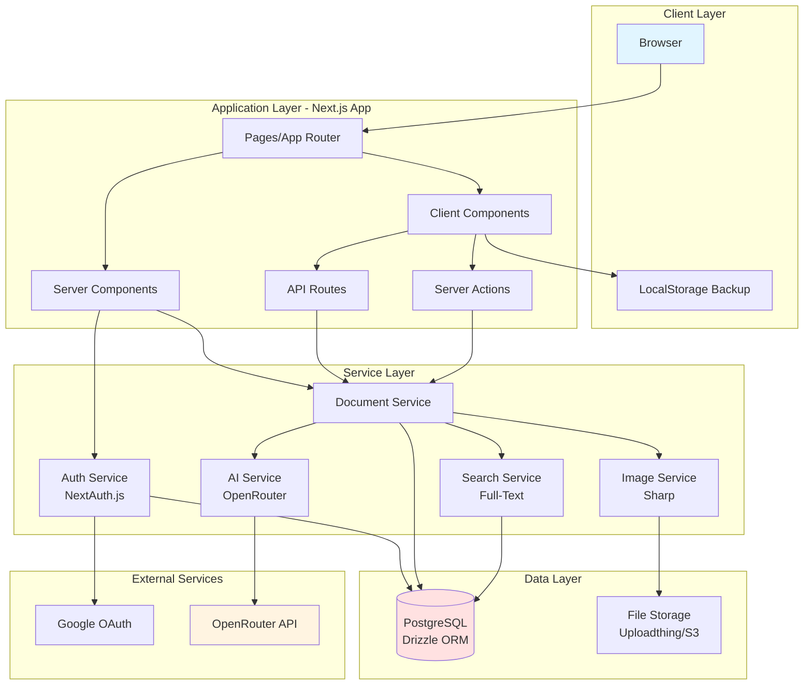
```mermaid
graph TB
    subgraph "Client Layer"
        Browser[Browser]
        LocalStorage[LocalStorage Backup]
    end

    subgraph "Application Layer - Next.js App"
        Pages[Pages/App Router]
        ServerComponents[Server Components]
        ClientComponents[Client Components]
        APIRoutes[API Routes]
        ServerActions[Server Actions]
    end

    subgraph "Service Layer"
        AuthService[Auth Service<br/>NextAuth.js]
        DocumentService[Document Service]
        AIService[AI Service<br/>OpenRouter]
        ImageService[Image Service<br/>Sharp]
        SearchService[Search Service<br/>Full-Text]
    end

    subgraph "Data Layer"
        PostgreSQL[(PostgreSQL<br/>Drizzle ORM)]
        FileStorage[File Storage<br/>Uploadthing/S3]
    end

    subgraph "External Services"
        GoogleOAuth[Google OAuth]
        OpenRouter[OpenRouter API]
    end

    Browser --> Pages
    Pages --> ServerComponents
    Pages --> ClientComponents
    ClientComponents --> APIRoutes
    ClientComponents --> ServerActions
    ClientComponents --> LocalStorage

    ServerComponents --> DocumentService
    ServerComponents --> AuthService
    APIRoutes --> DocumentService
    ServerActions --> DocumentService

    AuthService --> GoogleOAuth
    AuthService --> PostgreSQL
    DocumentService --> PostgreSQL
    DocumentService --> AIService
    DocumentService --> ImageService
    DocumentService --> SearchService

    AIService --> OpenRouter
    ImageService --> FileStorage
    SearchService --> PostgreSQL

    style Browser fill:#e1f5ff
    style PostgreSQL fill:#ffe1e1
    style OpenRouter fill:#fff4e1
```

---

## Application Architecture

### Next.js 16 App Router Structure

```
app/
├── (auth)/
│   ├── login/
│   │   └── page.tsx                 # Login page (Google + Email/Password)
│   ├── signup/
│   │   └── page.tsx                 # Signup page (no email verification)
│   └── layout.tsx                   # Auth layout
│
├── (dashboard)/
│   ├── layout.tsx                   # Main app layout (sidebar + header)
│   ├── page.tsx                     # Home/Dashboard
│   ├── documents/
│   │   ├── [id]/
│   │   │   ├── page.tsx             # Document view/edit (UUID-based)
│   │   │   └── edit/
│   │   │       └── page.tsx         # Document editor
│   │   └── new/
│   │       └── page.tsx             # New document (template selection)
│   ├── folders/
│   │   └── [id]/
│   │       └── page.tsx             # Folder contents (max 5 levels)
│   ├── search/
│   │   └── page.tsx                 # Search results (docs + comments)
│   └── settings/
│       ├── page.tsx                 # Workspace settings
│       ├── members/
│       │   └── page.tsx             # Team member management
│       └── profile/
│           └── page.tsx             # User profile
│
├── api/
│   ├── auth/
│   │   └── [...nextauth]/
│   │       └── route.ts             # NextAuth.js endpoints
│   ├── documents/
│   │   ├── route.ts                 # Document CRUD
│   │   ├── [id]/
│   │   │   ├── route.ts             # Single document ops
│   │   │   └── versions/
│   │   │       └── route.ts         # Version history
│   │   └── search/
│   │       └── route.ts             # Search API (Full-Text)
│   ├── ai/
│   │   ├── tag/
│   │   │   └── route.ts             # AI tagging (background job)
│   │   ├── summarize/
│   │   │   └── route.ts             # AI summarization
│   │   └── qa/
│   │       └── route.ts             # AI Q&A [Phase 4]
│   ├── images/
│   │   ├── upload/
│   │   │   └── route.ts             # Image upload + Sharp optimization
│   │   └── [id]/
│   │       └── route.ts             # Image deletion
│   ├── comments/
│   │   ├── route.ts                 # Comment CRUD
│   │   └── [id]/
│   │       └── route.ts             # Single comment ops
│   └── webhooks/
│       └── ai-job/
│           └── route.ts             # AI job status webhook
│
└── share/
    └── [token]/
        └── page.tsx                 # Public share link (read-only)
```

### Server Actions

```typescript
// app/actions/documents.ts
'use server'

export async function createDocument(data: CreateDocumentInput)
export async function updateDocument(id: string, data: UpdateDocumentInput)
export async function deleteDocument(id: string)
export async function saveDocumentDraft(id: string, content: string) // LocalStorage backup

// app/actions/ai.ts
'use server'

export async function triggerAITagging(documentId: string)
export async function triggerAISummarization(documentId: string)
export async function acceptAISuggestedTags(documentId: string, tagIds: string[])
export async function rejectAISuggestedTags(documentId: string, tagIds: string[])

// app/actions/folders.ts
'use server'

export async function createFolder(data: CreateFolderInput)
export async function moveDocument(documentId: string, targetFolderId: string)
export async function validateFolderDepth(parentId: string): Promise<number>

// app/actions/members.ts
'use server'

export async function removeMember(userId: string)
export async function transferDocumentOwnership(documentId: string, newOwnerId: string)
```

---

## Database Schema

### Entity Relationship Diagram

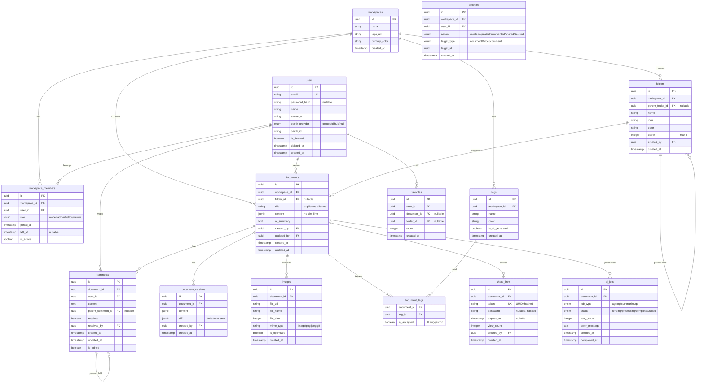
```mermaid
erDiagram
    workspaces ||--o{ workspace_members : has
    workspaces ||--o{ folders : contains
    workspaces ||--o{ documents : contains
    workspaces ||--o{ tags : has

    users ||--o{ workspace_members : belongs
    users ||--o{ documents : creates
    users ||--o{ comments : writes
    users ||--o{ favorites : has

    folders ||--o{ folders : "parent-child"
    folders ||--o{ documents : contains

    documents ||--o{ document_versions : has
    documents ||--o{ images : contains
    documents ||--o{ document_tags : tagged
    documents ||--o{ comments : has
    documents ||--o{ share_links : shared
    documents ||--o{ ai_jobs : processed

    tags ||--o{ document_tags : used

    comments ||--o{ comments : "parent-child"

    workspaces {
        uuid id PK
        string name
        string logo_url
        string primary_color
        timestamp created_at
    }

    users {
        uuid id PK
        string email UK
        string password_hash "nullable"
        string name
        string avatar_url
        enum oauth_provider "google/github/null"
        string oauth_id
        boolean is_deleted
        timestamp deleted_at
        timestamp created_at
    }

    workspace_members {
        uuid id PK
        uuid workspace_id FK
        uuid user_id FK
        enum role "owner/admin/editor/viewer"
        timestamp joined_at
        timestamp left_at "nullable"
        boolean is_active
    }

    folders {
        uuid id PK
        uuid workspace_id FK
        uuid parent_folder_id FK "nullable"
        string name
        string icon
        string color
        integer depth "max 5"
        uuid created_by FK
        timestamp created_at
    }

    documents {
        uuid id PK
        uuid workspace_id FK
        uuid folder_id FK "nullable"
        string title "duplicates allowed"
        jsonb content "no size limit"
        text ai_summary
        uuid created_by FK
        uuid updated_by FK
        timestamp created_at
        timestamp updated_at
    }

    document_versions {
        uuid id PK
        uuid document_id FK
        jsonb content
        jsonb diff "delta from prev"
        uuid created_by FK
        timestamp created_at
    }

    images {
        uuid id PK
        uuid document_id FK
        string file_url
        string file_name
        integer file_size
        string mime_type "image/png|jpeg|gif"
        boolean is_optimized
        timestamp created_at
    }

    tags {
        uuid id PK
        uuid workspace_id FK
        string name
        string color
        boolean is_ai_generated
        timestamp created_at
    }

    document_tags {
        uuid document_id FK
        uuid tag_id FK
        boolean is_accepted "AI suggestion"
    }

    comments {
        uuid id PK
        uuid document_id FK
        uuid user_id FK
        text content
        uuid parent_comment_id FK "nullable"
        boolean resolved
        uuid resolved_by FK
        timestamp created_at
        timestamp updated_at
        boolean is_edited
    }

    favorites {
        uuid id PK
        uuid user_id FK
        uuid document_id FK "nullable"
        uuid folder_id FK "nullable"
        integer order
        timestamp created_at
    }

    share_links {
        uuid id PK
        uuid document_id FK
        string token UK "UUID+hashed"
        string password "nullable, hashed"
        timestamp expires_at "nullable"
        integer view_count
        uuid created_by FK
        timestamp created_at
    }

    activities {
        uuid id PK
        uuid workspace_id FK
        uuid user_id FK
        enum action "created/updated/commented/shared/deleted"
        enum target_type "document/folder/comment"
        uuid target_id
        timestamp created_at
    }

    ai_jobs {
        uuid id PK
        uuid document_id FK
        enum job_type "tagging/summarize/qa"
        enum status "pending/processing/completed/failed"
        integer retry_count
        text error_message
        timestamp created_at
        timestamp completed_at
    }
```

### Key Indexes

```sql
-- Performance indexes
CREATE INDEX idx_documents_workspace ON documents(workspace_id);
CREATE INDEX idx_documents_folder ON documents(folder_id);
CREATE INDEX idx_documents_created_by ON documents(created_by);
CREATE INDEX idx_folders_workspace ON folders(workspace_id);
CREATE INDEX idx_folders_parent ON folders(parent_folder_id);
CREATE INDEX idx_comments_document ON comments(document_id);
CREATE INDEX idx_ai_jobs_status ON ai_jobs(status);

-- Full-text search indexes
CREATE INDEX idx_documents_title_fts ON documents USING GIN(to_tsvector('english', title));
CREATE INDEX idx_documents_content_fts ON documents USING GIN(to_tsvector('english', content));
CREATE INDEX idx_comments_content_fts ON comments USING GIN(to_tsvector('english', content));
```

---

## Component Hierarchy

```mermaid
graph TB
    subgraph "App Shell"
        RootLayout[RootLayout]
        AuthLayout[AuthLayout]
        DashboardLayout[DashboardLayout]
    end

    subgraph "Dashboard Components"
        Header[Header]
        Sidebar[Sidebar]
        MainContent[MainContent]
    end

    subgraph "Header Components"
        DocumentCounter[DocumentCounter<br/>95/100]
        SearchBar[SearchBar<br/>Cmd+K]
        NotificationBell[NotificationBell]
        UserMenu[UserMenu]
    end

    subgraph "Sidebar Components"
        FavoritesList[FavoritesList<br/>max 20]
        FolderTree[FolderTree<br/>max 5 levels]
        TagCloud[TagCloud]
    end

    subgraph "Document Components"
        DocumentView[DocumentView]
        DocumentEditor[DocumentEditor<br/>Tiptap]
        AITagSuggestions[AITagSuggestions<br/>Accept/Reject]
        VersionHistory[VersionHistory<br/>Phase 4]
    end

    subgraph "Editor Components"
        TiptapEditor[TiptapEditor]
        Toolbar[Toolbar]
        ImageUploader[ImageUploader<br/>Sharp optimization]
        AutoSave[AutoSave<br/>LocalStorage backup]
    end

    subgraph "Collaboration Components"
        CommentThread[CommentThread]
        CommentForm[CommentForm<br/>Viewer can comment]
        MentionInput[MentionInput<br/>@username]
        ShareDialog[ShareDialog<br/>UUID tokens]
    end

    RootLayout --> AuthLayout
    RootLayout --> DashboardLayout
    DashboardLayout --> Header
    DashboardLayout --> Sidebar
    DashboardLayout --> MainContent

    Header --> DocumentCounter
    Header --> SearchBar
    Header --> NotificationBell
    Header --> UserMenu

    Sidebar --> FavoritesList
    Sidebar --> FolderTree
    Sidebar --> TagCloud

    MainContent --> DocumentView
    DocumentView --> DocumentEditor
    DocumentView --> AITagSuggestions
    DocumentView --> VersionHistory
    DocumentView --> CommentThread

    DocumentEditor --> TiptapEditor
    TiptapEditor --> Toolbar
    TiptapEditor --> ImageUploader
    TiptapEditor --> AutoSave

    CommentThread --> CommentForm
    CommentForm --> MentionInput

    style DocumentEditor fill:#e1ffe1
    style AITagSuggestions fill:#fff4e1
    style AutoSave fill:#ffe1e1
```

---

## Data Flow

### Document Creation Flow

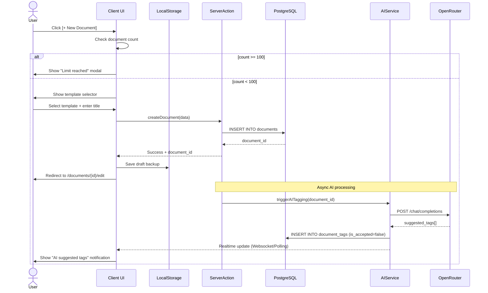
```mermaid
sequenceDiagram
    actor User
    participant UI as Client UI
    participant LocalStorage
    participant ServerAction
    participant DB as PostgreSQL
    participant AIService
    participant OpenRouter

    User->>UI: Click [+ New Document]
    UI->>UI: Check document count
    alt count >= 100
        UI->>User: Show "Limit reached" modal
    else count < 100
        UI->>User: Show template selector
        User->>UI: Select template + enter title
        UI->>ServerAction: createDocument(data)
        ServerAction->>DB: INSERT INTO documents
        DB-->>ServerAction: document_id
        ServerAction-->>UI: Success + document_id

        UI->>LocalStorage: Save draft backup
        UI->>User: Redirect to /documents/{id}/edit

        Note over ServerAction,OpenRouter: Async AI processing
        ServerAction->>AIService: triggerAITagging(document_id)
        AIService->>OpenRouter: POST /chat/completions
        OpenRouter-->>AIService: suggested_tags[]
        AIService->>DB: INSERT INTO document_tags (is_accepted=false)
        AIService-->>UI: Realtime update (Websocket/Polling)
        UI->>User: Show "AI suggested tags" notification
    end
```

### Document Auto-Save Flow

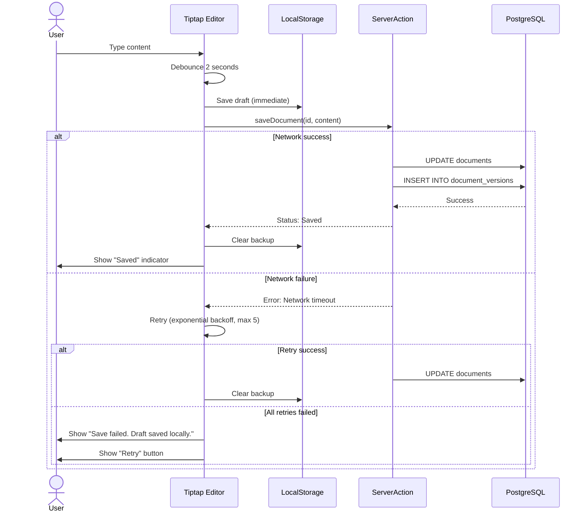
```mermaid
sequenceDiagram
    actor User
    participant Editor as Tiptap Editor
    participant LocalStorage
    participant ServerAction
    participant DB as PostgreSQL

    User->>Editor: Type content
    Editor->>Editor: Debounce 2 seconds
    Editor->>LocalStorage: Save draft (immediate)
    Editor->>ServerAction: saveDocument(id, content)

    alt Network success
        ServerAction->>DB: UPDATE documents
        ServerAction->>DB: INSERT INTO document_versions
        DB-->>ServerAction: Success
        ServerAction-->>Editor: Status: Saved
        Editor->>LocalStorage: Clear backup
        Editor->>User: Show "Saved" indicator
    else Network failure
        ServerAction-->>Editor: Error: Network timeout
        Editor->>Editor: Retry (exponential backoff, max 5)
        alt Retry success
            ServerAction->>DB: UPDATE documents
            Editor->>LocalStorage: Clear backup
        else All retries failed
            Editor->>User: Show "Save failed. Draft saved locally."
            Editor->>User: Show "Retry" button
        end
    end
```

### AI Tag Acceptance Flow

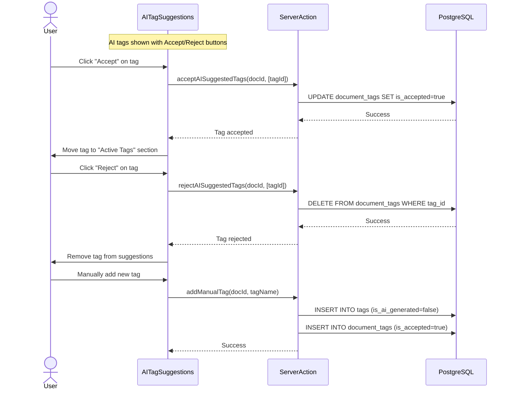
```mermaid
sequenceDiagram
    actor User
    participant UI as AITagSuggestions
    participant ServerAction
    participant DB as PostgreSQL

    Note over UI: AI tags shown with Accept/Reject buttons
    User->>UI: Click "Accept" on tag
    UI->>ServerAction: acceptAISuggestedTags(docId, [tagId])
    ServerAction->>DB: UPDATE document_tags SET is_accepted=true
    DB-->>ServerAction: Success
    ServerAction-->>UI: Tag accepted
    UI->>User: Move tag to "Active Tags" section

    User->>UI: Click "Reject" on tag
    UI->>ServerAction: rejectAISuggestedTags(docId, [tagId])
    ServerAction->>DB: DELETE FROM document_tags WHERE tag_id
    DB-->>ServerAction: Success
    ServerAction-->>UI: Tag rejected
    UI->>User: Remove tag from suggestions

    User->>UI: Manually add new tag
    UI->>ServerAction: addManualTag(docId, tagName)
    ServerAction->>DB: INSERT INTO tags (is_ai_generated=false)
    ServerAction->>DB: INSERT INTO document_tags (is_accepted=true)
    ServerAction-->>UI: Success
```

### Search Flow (Documents + Comments)

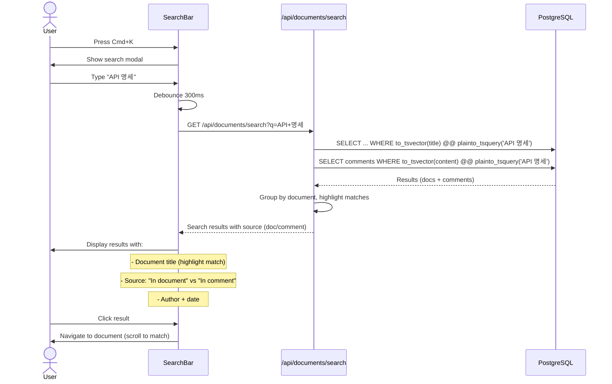
```mermaid
sequenceDiagram
    actor User
    participant UI as SearchBar
    participant API as /api/documents/search
    participant DB as PostgreSQL

    User->>UI: Press Cmd+K
    UI->>User: Show search modal
    User->>UI: Type "API 명세"
    UI->>UI: Debounce 300ms
    UI->>API: GET /api/documents/search?q=API+명세
    API->>DB: SELECT ... WHERE to_tsvector(title) @@ plainto_tsquery('API 명세')
    API->>DB: SELECT comments WHERE to_tsvector(content) @@ plainto_tsquery('API 명세')
    DB-->>API: Results (docs + comments)
    API->>API: Group by document, highlight matches
    API-->>UI: Search results with source (doc/comment)
    UI->>User: Display results with:
    Note over UI: - Document title (highlight match)
    Note over UI: - Source: "In document" vs "In comment"
    Note over UI: - Author + date
    User->>UI: Click result
    UI->>User: Navigate to document (scroll to match)
```

---

## Authentication Flow

### NextAuth.js Configuration

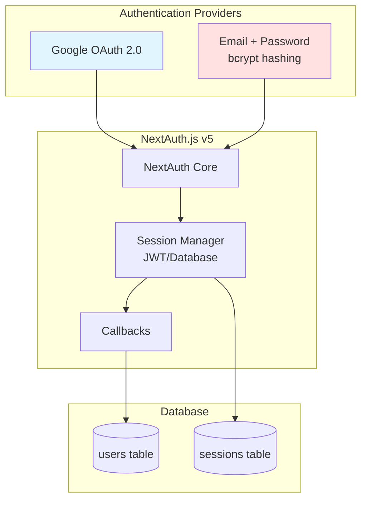
```mermaid
graph TB
    subgraph "Authentication Providers"
        GoogleOAuth[Google OAuth 2.0]
        EmailPassword[Email + Password<br/>bcrypt hashing]
    end

    subgraph "NextAuth.js v5"
        AuthCore[NextAuth Core]
        SessionManager[Session Manager<br/>JWT/Database]
        Callbacks[Callbacks]
    end

    subgraph "Database"
        UsersTable[(users table)]
        SessionsTable[(sessions table)]
    end

    GoogleOAuth --> AuthCore
    EmailPassword --> AuthCore
    AuthCore --> SessionManager
    SessionManager --> Callbacks
    Callbacks --> UsersTable
    SessionManager --> SessionsTable

    style GoogleOAuth fill:#e1f5ff
    style EmailPassword fill:#ffe1e1
```

### Login Flow

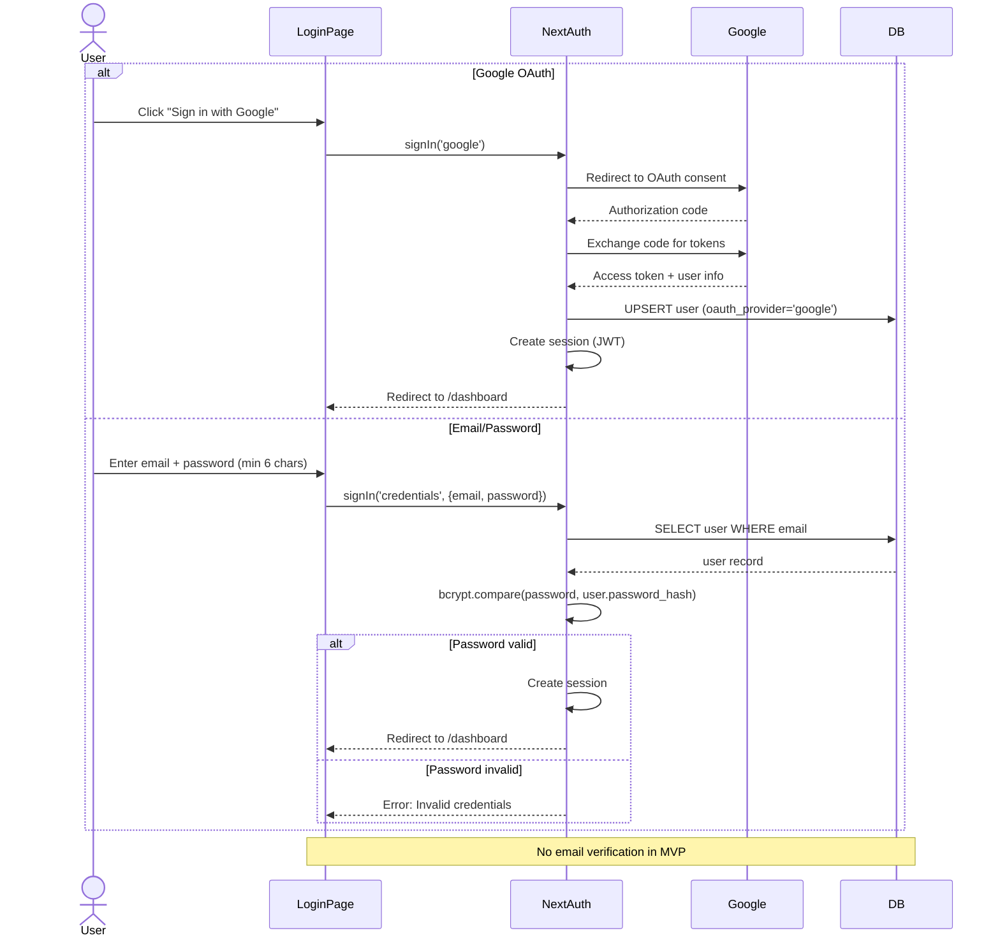
```mermaid
sequenceDiagram
    actor User
    participant LoginPage
    participant NextAuth
    participant Google
    participant DB

    alt Google OAuth
        User->>LoginPage: Click "Sign in with Google"
        LoginPage->>NextAuth: signIn('google')
        NextAuth->>Google: Redirect to OAuth consent
        Google-->>NextAuth: Authorization code
        NextAuth->>Google: Exchange code for tokens
        Google-->>NextAuth: Access token + user info
        NextAuth->>DB: UPSERT user (oauth_provider='google')
        NextAuth->>NextAuth: Create session (JWT)
        NextAuth-->>LoginPage: Redirect to /dashboard
    else Email/Password
        User->>LoginPage: Enter email + password (min 6 chars)
        LoginPage->>NextAuth: signIn('credentials', {email, password})
        NextAuth->>DB: SELECT user WHERE email
        DB-->>NextAuth: user record
        NextAuth->>NextAuth: bcrypt.compare(password, user.password_hash)
        alt Password valid
            NextAuth->>NextAuth: Create session
            NextAuth-->>LoginPage: Redirect to /dashboard
        else Password invalid
            NextAuth-->>LoginPage: Error: Invalid credentials
        end
    end

    Note over LoginPage,DB: No email verification in MVP
```

### Signup Flow

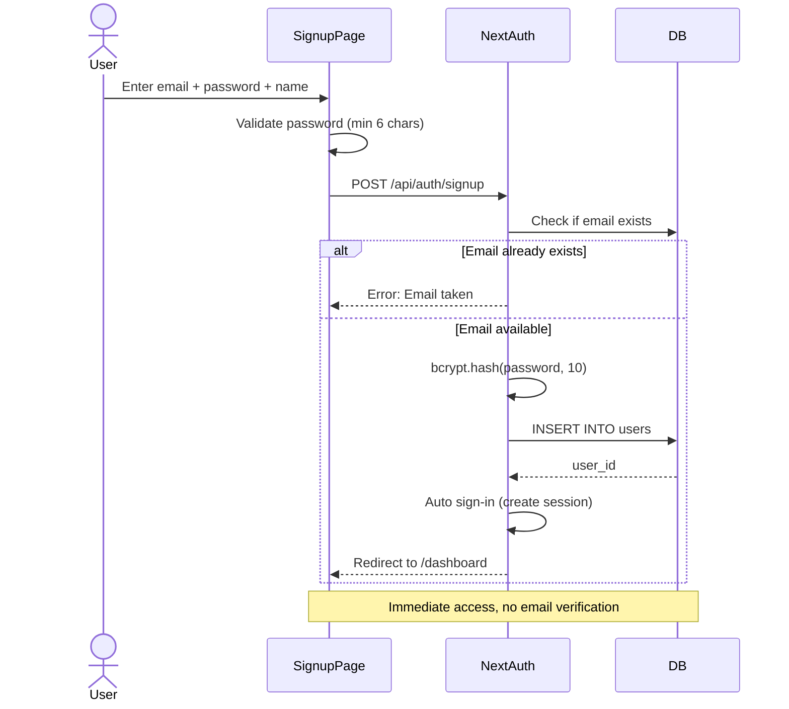
```mermaid
sequenceDiagram
    actor User
    participant SignupPage
    participant NextAuth
    participant DB

    User->>SignupPage: Enter email + password + name
    SignupPage->>SignupPage: Validate password (min 6 chars)
    SignupPage->>NextAuth: POST /api/auth/signup
    NextAuth->>DB: Check if email exists
    alt Email already exists
        NextAuth-->>SignupPage: Error: Email taken
    else Email available
        NextAuth->>NextAuth: bcrypt.hash(password, 10)
        NextAuth->>DB: INSERT INTO users
        DB-->>NextAuth: user_id
        NextAuth->>NextAuth: Auto sign-in (create session)
        NextAuth-->>SignupPage: Redirect to /dashboard
    end

    Note over SignupPage,DB: Immediate access, no email verification
```

### Permission Check Flow

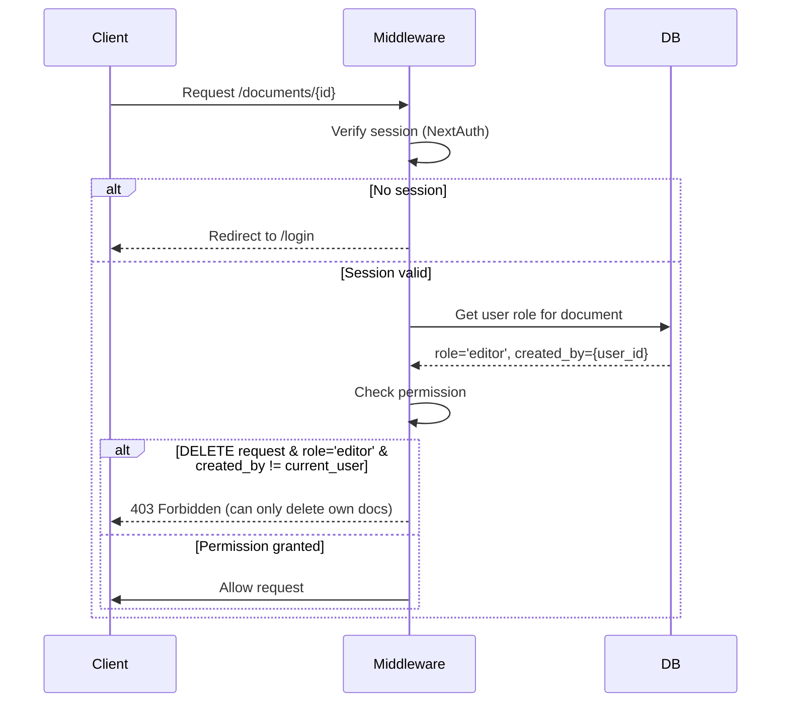
```mermaid
sequenceDiagram
    participant Client
    participant Middleware
    participant DB

    Client->>Middleware: Request /documents/{id}
    Middleware->>Middleware: Verify session (NextAuth)
    alt No session
        Middleware-->>Client: Redirect to /login
    else Session valid
        Middleware->>DB: Get user role for document
        DB-->>Middleware: role='editor', created_by={user_id}
        Middleware->>Middleware: Check permission

        alt DELETE request & role='editor' & created_by != current_user
            Middleware-->>Client: 403 Forbidden (can only delete own docs)
        else Permission granted
            Middleware->>Client: Allow request
        end
    end
```

---

## AI Processing Pipeline

### Background Job Architecture

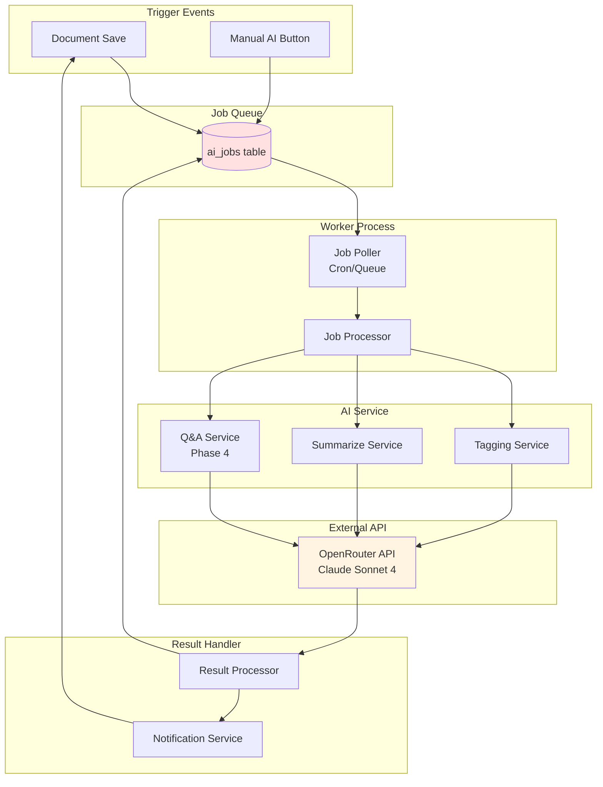
```mermaid
graph TB
    subgraph "Trigger Events"
        DocSave[Document Save]
        ManualTrigger[Manual AI Button]
    end

    subgraph "Job Queue"
        AIJobs[(ai_jobs table)]
    end

    subgraph "Worker Process"
        JobPoller[Job Poller<br/>Cron/Queue]
        JobProcessor[Job Processor]
    end

    subgraph "AI Service"
        TaggingService[Tagging Service]
        SummarizeService[Summarize Service]
        QAService[Q&A Service<br/>Phase 4]
    end

    subgraph "External API"
        OpenRouter[OpenRouter API<br/>Claude Sonnet 4]
    end

    subgraph "Result Handler"
        ResultProcessor[Result Processor]
        NotificationService[Notification Service]
    end

    DocSave --> AIJobs
    ManualTrigger --> AIJobs
    AIJobs --> JobPoller
    JobPoller --> JobProcessor

    JobProcessor --> TaggingService
    JobProcessor --> SummarizeService
    JobProcessor --> QAService

    TaggingService --> OpenRouter
    SummarizeService --> OpenRouter
    QAService --> OpenRouter

    OpenRouter --> ResultProcessor
    ResultProcessor --> AIJobs
    ResultProcessor --> NotificationService
    NotificationService --> DocSave

    style OpenRouter fill:#fff4e1
    style AIJobs fill:#ffe1e1
```

### AI Tagging Process

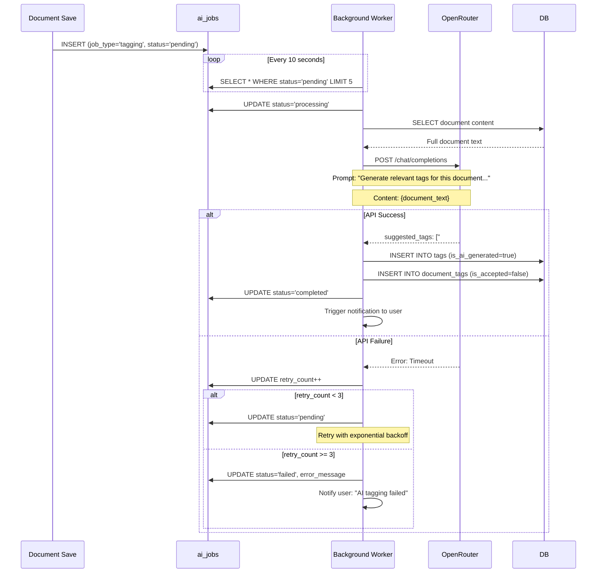
```mermaid
sequenceDiagram
    participant DocSave as Document Save
    participant JobQueue as ai_jobs
    participant Worker as Background Worker
    participant OpenRouter
    participant DB

    DocSave->>JobQueue: INSERT (job_type='tagging', status='pending')

    loop Every 10 seconds
        Worker->>JobQueue: SELECT * WHERE status='pending' LIMIT 5
    end

    Worker->>JobQueue: UPDATE status='processing'
    Worker->>DB: SELECT document content
    DB-->>Worker: Full document text

    Worker->>OpenRouter: POST /chat/completions
    Note over Worker,OpenRouter: Prompt: "Generate relevant tags for this document..."
    Note over Worker,OpenRouter: Content: {document_text}

    alt API Success
        OpenRouter-->>Worker: suggested_tags: ["#회의록", "#개발팀"]
        Worker->>DB: INSERT INTO tags (is_ai_generated=true)
        Worker->>DB: INSERT INTO document_tags (is_accepted=false)
        Worker->>JobQueue: UPDATE status='completed'
        Worker->>Worker: Trigger notification to user
    else API Failure
        OpenRouter-->>Worker: Error: Timeout
        Worker->>JobQueue: UPDATE retry_count++
        alt retry_count < 3
            Worker->>JobQueue: UPDATE status='pending'
            Note over Worker: Retry with exponential backoff
        else retry_count >= 3
            Worker->>JobQueue: UPDATE status='failed', error_message
            Worker->>Worker: Notify user: "AI tagging failed"
        end
    end
```

### Privacy & Data Flow

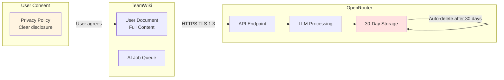
```mermaid
graph LR
    subgraph "TeamWiki"
        Doc[User Document<br/>Full Content]
        AIJob[AI Job Queue]
    end

    subgraph "OpenRouter"
        APIEndpoint[API Endpoint]
        Processing[LLM Processing]
        Storage[30-Day Storage]
    end

    subgraph "User Consent"
        PrivacyPolicy[Privacy Policy<br/>Clear disclosure]
    end

    Doc -->|HTTPS TLS 1.3| APIEndpoint
    APIEndpoint --> Processing
    Processing --> Storage
    Storage -->|Auto-delete after 30 days| Storage

    PrivacyPolicy -.->|User agrees| Doc

    style Storage fill:#ffe1e1
    style PrivacyPolicy fill:#fff4e1
```

---

## File Upload & Storage

### Image Upload & Optimization Flow

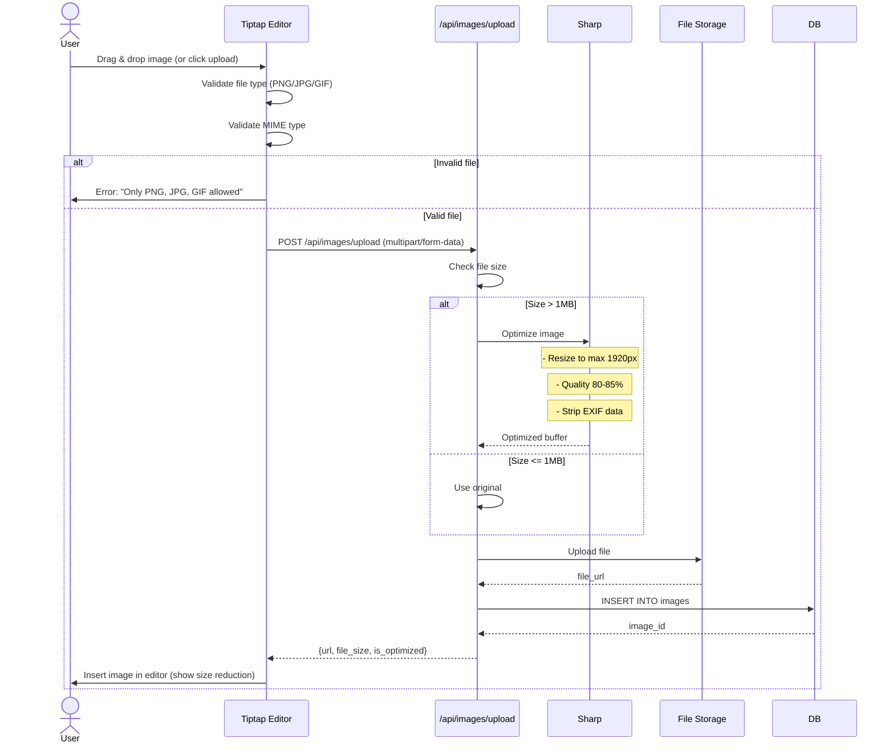
```mermaid
sequenceDiagram
    actor User
    participant Editor as Tiptap Editor
    participant API as /api/images/upload
    participant Sharp
    participant Storage as File Storage
    participant DB

    User->>Editor: Drag & drop image (or click upload)
    Editor->>Editor: Validate file type (PNG/JPG/GIF)
    Editor->>Editor: Validate MIME type

    alt Invalid file
        Editor->>User: Error: "Only PNG, JPG, GIF allowed"
    else Valid file
        Editor->>API: POST /api/images/upload (multipart/form-data)
        API->>API: Check file size

        alt Size > 1MB
            API->>Sharp: Optimize image
            Note over Sharp: - Resize to max 1920px
            Note over Sharp: - Quality 80-85%
            Note over Sharp: - Strip EXIF data
            Sharp-->>API: Optimized buffer
        else Size <= 1MB
            API->>API: Use original
        end

        API->>Storage: Upload file
        Storage-->>API: file_url
        API->>DB: INSERT INTO images
        DB-->>API: image_id
        API-->>Editor: {url, file_size, is_optimized}
        Editor->>User: Insert image in editor (show size reduction)
    end
```

### Document Deletion Flow (with Images)

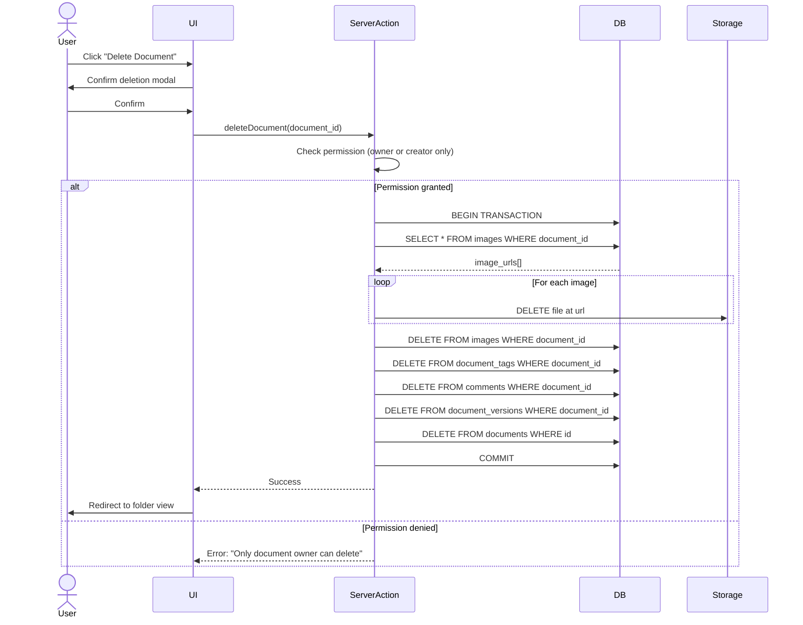
```mermaid
sequenceDiagram
    actor User
    participant UI
    participant ServerAction
    participant DB
    participant Storage

    User->>UI: Click "Delete Document"
    UI->>User: Confirm deletion modal
    User->>UI: Confirm

    UI->>ServerAction: deleteDocument(document_id)
    ServerAction->>ServerAction: Check permission (owner or creator only)

    alt Permission granted
        ServerAction->>DB: BEGIN TRANSACTION
        ServerAction->>DB: SELECT * FROM images WHERE document_id
        DB-->>ServerAction: image_urls[]

        loop For each image
            ServerAction->>Storage: DELETE file at url
        end

        ServerAction->>DB: DELETE FROM images WHERE document_id
        ServerAction->>DB: DELETE FROM document_tags WHERE document_id
        ServerAction->>DB: DELETE FROM comments WHERE document_id
        ServerAction->>DB: DELETE FROM document_versions WHERE document_id
        ServerAction->>DB: DELETE FROM documents WHERE id
        ServerAction->>DB: COMMIT

        ServerAction-->>UI: Success
        UI->>User: Redirect to folder view
    else Permission denied
        ServerAction-->>UI: Error: "Only document owner can delete"
    end
```

---

## Security Architecture

### Security Layers

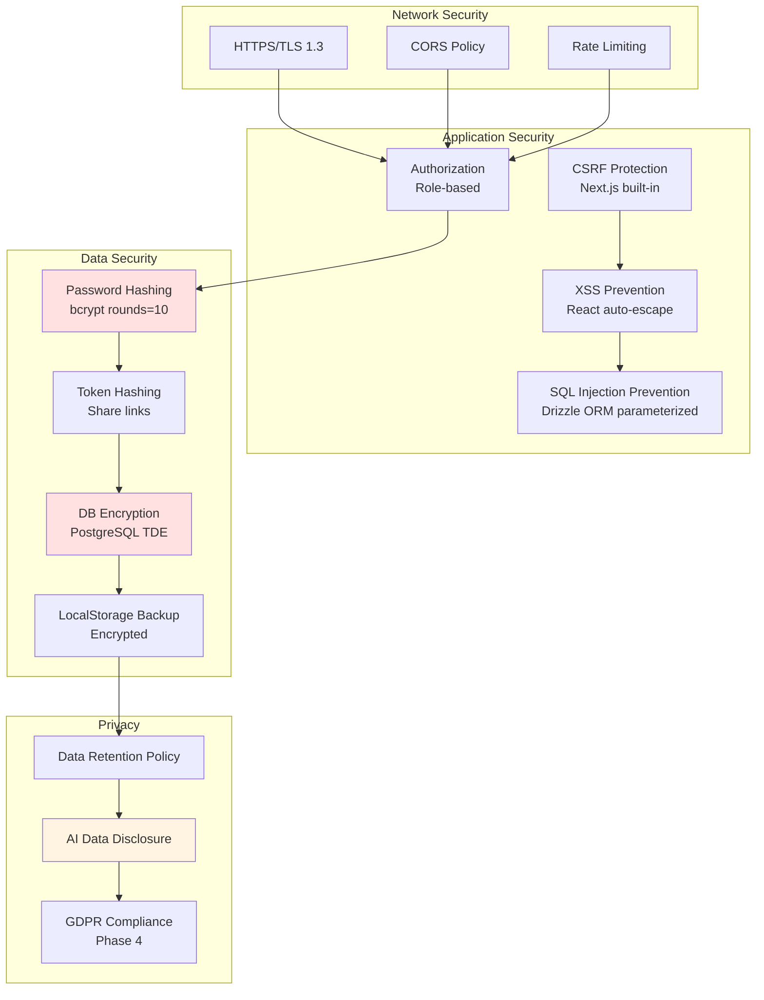
```mermaid
graph TB
    subgraph "Network Security"
        HTTPS[HTTPS/TLS 1.3]
        CORS[CORS Policy]
        RateLimit[Rate Limiting]
    end

    subgraph "Application Security"
        AuthZ[Authorization<br/>Role-based]
        CSRF[CSRF Protection<br/>Next.js built-in]
        XSS[XSS Prevention<br/>React auto-escape]
        SQLInjection[SQL Injection Prevention<br/>Drizzle ORM parameterized]
    end

    subgraph "Data Security"
        PasswordHash[Password Hashing<br/>bcrypt rounds=10]
        TokenHash[Token Hashing<br/>Share links]
        DBEncryption[DB Encryption<br/>PostgreSQL TDE]
        Backup[LocalStorage Backup<br/>Encrypted]
    end

    subgraph "Privacy"
        DataRetention[Data Retention Policy]
        AIDisclosure[AI Data Disclosure]
        GDPR[GDPR Compliance<br/>Phase 4]
    end

    HTTPS --> AuthZ
    CORS --> AuthZ
    RateLimit --> AuthZ
    AuthZ --> PasswordHash
    CSRF --> XSS
    XSS --> SQLInjection
    PasswordHash --> TokenHash
    TokenHash --> DBEncryption
    DBEncryption --> Backup
    Backup --> DataRetention
    DataRetention --> AIDisclosure
    AIDisclosure --> GDPR

    style PasswordHash fill:#ffe1e1
    style DBEncryption fill:#ffe1e1
    style AIDisclosure fill:#fff4e1
```

### Permission Matrix

| Role | Create Doc | Edit Own | Edit Others | Delete Own | Delete Others | Comment | Delete Comment | Manage Members |
|------|-----------|----------|-------------|-----------|---------------|---------|----------------|----------------|
| **Owner** | ✅ | ✅ | ✅ | ✅ | ✅ | ✅ | ✅ (all) | ✅ |
| **Admin** | ✅ | ✅ | ✅ | ✅ | ✅ | ✅ | ✅ (all) | ✅ |
| **Editor** | ✅ | ✅ | ✅ | ✅ | ❌ | ✅ | ✅ (own) | ❌ |
| **Viewer** | ❌ | ❌ | ❌ | ❌ | ❌ | ✅ | ✅ (own) | ❌ |

---

## Deployment Architecture

### Production Deployment (Vercel)

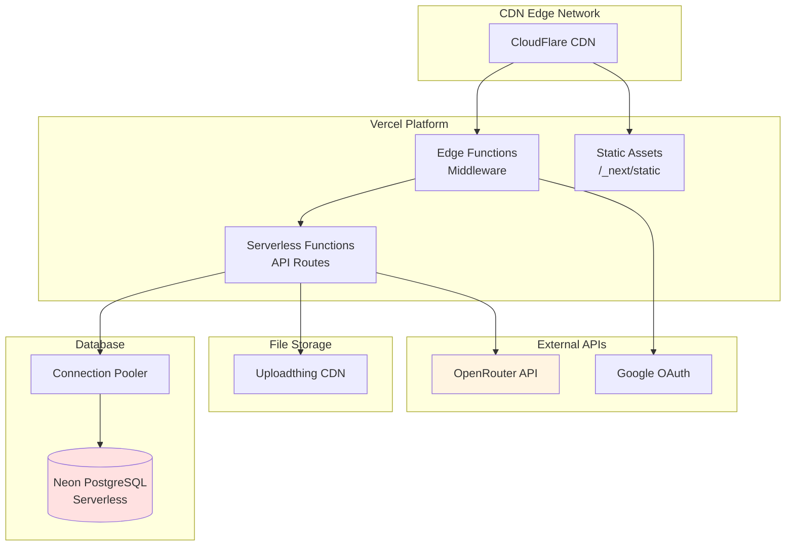
```mermaid
graph TB
    subgraph "CDN Edge Network"
        CloudFlare[CloudFlare CDN]
    end

    subgraph "Vercel Platform"
        EdgeFunctions[Edge Functions<br/>Middleware]
        ServerlessAPI[Serverless Functions<br/>API Routes]
        StaticAssets[Static Assets<br/>/_next/static]
    end

    subgraph "Database"
        NeonDB[(Neon PostgreSQL<br/>Serverless)]
        ConnectionPool[Connection Pooler]
    end

    subgraph "File Storage"
        UploadthingCDN[Uploadthing CDN]
    end

    subgraph "External APIs"
        OpenRouterAPI[OpenRouter API]
        GoogleOAuthAPI[Google OAuth]
    end

    CloudFlare --> EdgeFunctions
    CloudFlare --> StaticAssets
    EdgeFunctions --> ServerlessAPI
    ServerlessAPI --> ConnectionPool
    ConnectionPool --> NeonDB
    ServerlessAPI --> UploadthingCDN
    ServerlessAPI --> OpenRouterAPI
    EdgeFunctions --> GoogleOAuthAPI

    style NeonDB fill:#ffe1e1
    style OpenRouterAPI fill:#fff4e1
```

### Environment Variables

```bash
# Database
DATABASE_URL="postgresql://..."
DATABASE_DIRECT_URL="postgresql://..." # For migrations

# NextAuth.js
NEXTAUTH_URL="https://teamwiki.app"
NEXTAUTH_SECRET="random-secret-key"

# OAuth
GOOGLE_CLIENT_ID="..."
GOOGLE_CLIENT_SECRET="..."

# AI
OPENROUTER_API_KEY="..."
OPENROUTER_MODEL="anthropic/claude-sonnet-4"

# File Storage
UPLOADTHING_SECRET="..."
UPLOADTHING_APP_ID="..."

# Optional (Phase 4)
RESEND_API_KEY="..."
SLACK_CLIENT_ID="..."
SLACK_CLIENT_SECRET="..."
```

---

## Performance Considerations

### Optimization Strategies

1. **Server Components**: Use React Server Components for data fetching
2. **Image Optimization**: Sharp compression (1MB+ → 80% quality, max 1920px)
3. **Database Indexing**: Full-text search indexes on title/content/comments
4. **Connection Pooling**: Drizzle + Neon connection pooler
5. **Static Generation**: Pre-render public pages where possible
6. **Code Splitting**: Dynamic imports for heavy components (editor, etc.)
7. **LocalStorage Caching**: Draft backup for offline resilience
8. **Async AI Processing**: Background jobs prevent blocking user interactions

### Monitoring & Alerts

- **Document count tracking**: Alert at 90/100 (90% limit)
- **AI job failures**: Alert after 3 consecutive failures
- **Database performance**: Monitor slow queries (> 500ms)
- **Storage usage**: Alert at 80% capacity
- **API rate limits**: Track OpenRouter usage

---

## Future Architecture (Phase 4)

### Real-time Collaboration

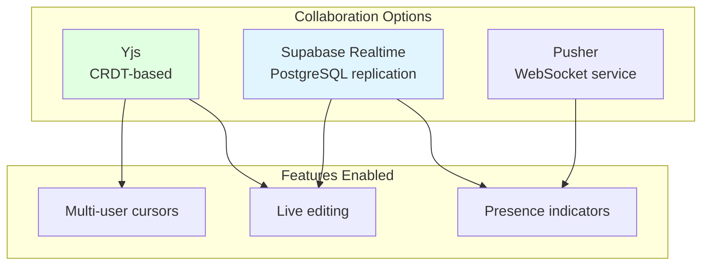
```mermaid
graph TB
    subgraph "Collaboration Options"
        Yjs[Yjs<br/>CRDT-based]
        Supabase[Supabase Realtime<br/>PostgreSQL replication]
        Pusher[Pusher<br/>WebSocket service]
    end

    subgraph "Features Enabled"
        Cursors[Multi-user cursors]
        LiveEditing[Live editing]
        Presence[Presence indicators]
    end

    Yjs --> Cursors
    Yjs --> LiveEditing
    Supabase --> LiveEditing
    Supabase --> Presence
    Pusher --> Presence

    style Yjs fill:#e1ffe1
    style Supabase fill:#e1f5ff
```

### Email Notifications


```mermaid
graph LR
    Events[App Events<br/>@mention, comment, share] --> EmailQueue[Email Queue]
    EmailQueue --> Resend[Resend API]
    Resend --> UserInbox[User Inbox]

    style Resend fill:#fff4e1
```

---

## Document Version

| Version | Date | Changes |
|---------|------|---------|
| 1.0 | 2026-01-27 | Initial architecture document |

**Status**: ✅ Complete - Ready for implementation review
