# TeamWiki - Component Structure

> **Version**: 1.0
> **Date**: 2026-01-27
> **Framework**: Next.js 16 + React 19 + TypeScript

---

## Table of Contents
1. [Component Architecture](#component-architecture)
2. [Layout Components](#layout-components)
3. [Feature Components](#feature-components)
4. [Shared Components](#shared-components)
5. [User Interaction Flows](#user-interaction-flows)
6. [Component Props Reference](#component-props-reference)
7. [State Management](#state-management)

---

## Component Architecture

### Design Principles

1. **Server Components First**: Use React Server Components for data fetching
2. **Client Boundaries**: Mark interactive components with `'use client'`
3. **Composition over Props**: Prefer children/slots over complex prop drilling
4. **Type Safety**: All props strictly typed with TypeScript
5. **Accessibility**: ARIA labels, keyboard navigation, focus management

### Component Hierarchy

```
app/
├── layout.tsx (Root Layout)
│
├── (auth)/
│   ├── layout.tsx (AuthLayout)
│   ├── login/page.tsx (LoginPage)
│   └── signup/page.tsx (SignupPage)
│
└── (dashboard)/
    ├── layout.tsx (DashboardLayout)
    │   ├── <Header />
    │   ├── <Sidebar />
    │   └── <MainContent />
    │
    ├── page.tsx (HomePage)
    ├── documents/
    │   ├── [id]/page.tsx (DocumentViewPage)
    │   │   ├── <DocumentHeader />
    │   │   ├── <DocumentContent />
    │   │   ├── <AITagSuggestions />
    │   │   ├── <CommentSection />
    │   │   └── <RightPanel />
    │   │
    │   ├── [id]/edit/page.tsx (DocumentEditPage)
    │   │   ├── <EditorToolbar />
    │   │   ├── <TiptapEditor />
    │   │   └── <AutoSaveIndicator />
    │   │
    │   └── new/page.tsx (NewDocumentPage)
    │       └── <TemplateSelector />
    │
    ├── search/page.tsx (SearchPage)
    │   ├── <SearchBar />
    │   └── <SearchResults />
    │
    └── settings/
        ├── page.tsx (SettingsPage)
        └── members/page.tsx (MembersPage)
```

---

## Layout Components

### 1. RootLayout

**File**: `app/layout.tsx`

**Purpose**: Global app wrapper with providers and meta tags.

```typescript
import { Inter } from 'next/font/google'
import { Providers } from '@/components/providers'
import '@/styles/globals.css'

const inter = Inter({ subsets: ['latin'] })

export const metadata = {
  title: 'TeamWiki - AI-Powered Knowledge Management',
  description: '팀의 모든 지식을 AI가 정리',
}

export default function RootLayout({
  children,
}: {
  children: React.ReactNode
}) {
  return (
    <html lang="ko" suppressHydrationWarning>
      <body className={inter.className}>
        <Providers>
          {children}
        </Providers>
      </body>
    </html>
  )
}
```

**Props**: None (children only)

**Features**:
- Font optimization (Inter)
- Theme provider (dark/light mode)
- NextAuth session provider
- Toast notifications provider

---

### 2. AuthLayout

**File**: `app/(auth)/layout.tsx`

**Purpose**: Centered layout for login/signup pages.

```typescript
export default function AuthLayout({
  children,
}: {
  children: React.ReactNode
}) {
  return (
    <div className="min-h-screen flex items-center justify-center bg-gray-50 dark:bg-gray-900">
      <div className="max-w-md w-full space-y-8">
        {/* Logo */}
        <div className="text-center">
          <h1 className="text-3xl font-bold">🏠 TeamWiki</h1>
          <p className="mt-2 text-gray-600 dark:text-gray-400">
            팀의 모든 지식을 AI가 정리
          </p>
        </div>

        {children}
      </div>
    </div>
  )
}
```

**Props**: None (children only)

---

### 3. DashboardLayout

**File**: `app/(dashboard)/layout.tsx`

**Purpose**: Main app shell with sidebar and header.

```typescript
import { Header } from '@/components/layout/header'
import { Sidebar } from '@/components/layout/sidebar'
import { getSession } from '@/lib/auth'
import { redirect } from 'next/navigation'

export default async function DashboardLayout({
  children,
}: {
  children: React.ReactNode
}) {
  const session = await getSession()
  if (!session) redirect('/login')

  return (
    <div className="h-screen flex overflow-hidden bg-white dark:bg-gray-900">
      {/* Sidebar */}
      <Sidebar className="w-64 flex-shrink-0" />

      {/* Main content area */}
      <div className="flex-1 flex flex-col overflow-hidden">
        <Header />

        <main className="flex-1 overflow-y-auto p-6">
          {children}
        </main>
      </div>
    </div>
  )
}
```

**Props**:
- `children: React.ReactNode` - Page content

**Server Component**: ✅ (fetches session)

---

## Feature Components

### Header Component

**File**: `components/layout/header.tsx`

```typescript
'use client'

import { DocumentCounter } from './document-counter'
import { SearchBar } from './search-bar'
import { NotificationBell } from './notification-bell'
import { UserMenu } from './user-menu'

interface HeaderProps {
  className?: string
}

export function Header({ className }: HeaderProps) {
  return (
    <header className={cn(
      'h-16 border-b border-gray-200 dark:border-gray-800',
      'flex items-center justify-between px-6',
      className
    )}>
      {/* Left: Document counter */}
      <DocumentCounter />

      {/* Center: Search bar */}
      <div className="flex-1 max-w-2xl mx-8">
        <SearchBar />
      </div>

      {/* Right: Notifications + User menu */}
      <div className="flex items-center gap-4">
        <NotificationBell />
        <UserMenu />
      </div>
    </header>
  )
}
```

**Props**:
```typescript
interface HeaderProps {
  className?: string
}
```

**Client Component**: ✅ (interactive)

---

### DocumentCounter Component

**File**: `components/layout/document-counter.tsx`

```typescript
'use client'

import { useDocumentCount } from '@/hooks/use-document-count'
import { cn } from '@/lib/utils'

export function DocumentCounter() {
  const { count, limit } = useDocumentCount()
  const percentage = (count / limit) * 100
  const isNearLimit = percentage >= 90

  return (
    <div className={cn(
      'flex items-center gap-2 px-3 py-1.5 rounded-lg',
      'bg-gray-100 dark:bg-gray-800',
      isNearLimit && 'bg-red-50 dark:bg-red-900/20'
    )}>
      <span className={cn(
        'text-sm font-medium',
        isNearLimit && 'text-red-600 dark:text-red-400'
      )}>
        {count}/{limit}
      </span>
      <span className="text-xs text-gray-500">문서</span>
    </div>
  )
}
```

**Props**: None

**State**:
- `count: number` - Current document count
- `limit: number` - Maximum documents (100 for MVP)

**Behavior**:
- Red background when ≥ 90 documents
- Updates in real-time on document creation/deletion

---

### SearchBar Component

**File**: `components/layout/search-bar.tsx`

```typescript
'use client'

import { useState, useCallback } from 'react'
import { useDebounce } from '@/hooks/use-debounce'
import { useRouter } from 'next/navigation'
import { Search } from 'lucide-react'

export function SearchBar() {
  const [query, setQuery] = useState('')
  const router = useRouter()
  const debouncedQuery = useDebounce(query, 300)

  const handleSearch = useCallback(() => {
    if (debouncedQuery.trim()) {
      router.push(`/search?q=${encodeURIComponent(debouncedQuery)}`)
    }
  }, [debouncedQuery, router])

  // Keyboard shortcut: Cmd+K
  useEffect(() => {
    const handler = (e: KeyboardEvent) => {
      if ((e.metaKey || e.ctrlKey) && e.key === 'k') {
        e.preventDefault()
        // Focus search input
      }
    }
    window.addEventListener('keydown', handler)
    return () => window.removeEventListener('keydown', handler)
  }, [])

  return (
    <div className="relative">
      <Search className="absolute left-3 top-1/2 -translate-y-1/2 h-4 w-4 text-gray-400" />
      <input
        type="text"
        placeholder="문서 검색... (Cmd+K)"
        value={query}
        onChange={(e) => setQuery(e.target.value)}
        onKeyDown={(e) => e.key === 'Enter' && handleSearch()}
        className="w-full pl-10 pr-4 py-2 rounded-lg border border-gray-300 dark:border-gray-700
                   focus:outline-none focus:ring-2 focus:ring-blue-500"
      />
    </div>
  )
}
```

**Props**: None

**Features**:
- Debounced search (300ms)
- Keyboard shortcut (Cmd+K)
- Real-time suggestions (future)

---

### Sidebar Component

**File**: `components/layout/sidebar.tsx`

```typescript
'use client'

import { FavoritesList } from './favorites-list'
import { FolderTree } from './folder-tree'
import { TagCloud } from './tag-cloud'

interface SidebarProps {
  className?: string
}

export function Sidebar({ className }: SidebarProps) {
  return (
    <aside className={cn(
      'border-r border-gray-200 dark:border-gray-800',
      'flex flex-col overflow-hidden',
      className
    )}>
      {/* New document button */}
      <div className="p-4">
        <button className="w-full py-2 px-4 bg-blue-600 text-white rounded-lg
                           hover:bg-blue-700 transition">
          + 새 문서
        </button>
      </div>

      {/* Scrollable content */}
      <div className="flex-1 overflow-y-auto p-4 space-y-6">
        <FavoritesList />
        <FolderTree />
        <TagCloud />
      </div>
    </aside>
  )
}
```

**Props**:
```typescript
interface SidebarProps {
  className?: string
}
```

---

### FavoritesList Component

**File**: `components/layout/favorites-list.tsx`

```typescript
'use client'

import { useFavorites } from '@/hooks/use-favorites'
import { DragDropContext, Droppable, Draggable } from '@hello-pangea/dnd'
import { Star, FileText, Folder } from 'lucide-react'

export function FavoritesList() {
  const { favorites, reorder } = useFavorites()

  if (favorites.length === 0) {
    return (
      <section>
        <h3 className="text-sm font-semibold text-gray-700 dark:text-gray-300 mb-2">
          ⭐ 즐겨찾기
        </h3>
        <p className="text-xs text-gray-500">즐겨찾기가 없습니다</p>
      </section>
    )
  }

  return (
    <section>
      <h3 className="text-sm font-semibold text-gray-700 dark:text-gray-300 mb-2">
        ⭐ 즐겨찾기 ({favorites.length}/20)
      </h3>

      <DragDropContext onDragEnd={reorder}>
        <Droppable droppableId="favorites">
          {(provided) => (
            <div
              ref={provided.innerRef}
              {...provided.droppableProps}
              className="space-y-1"
            >
              {favorites.map((item, index) => (
                <Draggable key={item.id} draggableId={item.id} index={index}>
                  {(provided) => (
                    <a
                      ref={provided.innerRef}
                      {...provided.draggableProps}
                      {...provided.dragHandleProps}
                      href={item.type === 'document' ? `/documents/${item.id}` : `/folders/${item.id}`}
                      className="flex items-center gap-2 px-2 py-1.5 rounded hover:bg-gray-100 dark:hover:bg-gray-800"
                    >
                      {item.type === 'document' ? (
                        <FileText className="h-4 w-4 text-gray-400" />
                      ) : (
                        <Folder className="h-4 w-4 text-gray-400" />
                      )}
                      <span className="text-sm truncate">{item.name}</span>
                    </a>
                  )}
                </Draggable>
              ))}
              {provided.placeholder}
            </div>
          )}
        </Droppable>
      </DragDropContext>
    </section>
  )
}
```

**Props**: None

**Features**:
- Drag-and-drop reordering
- Max 20 items (shows count)
- Supports folders and documents

---

### FolderTree Component

**File**: `components/layout/folder-tree.tsx`

```typescript
'use client'

import { useFolders } from '@/hooks/use-folders'
import { ChevronRight, ChevronDown, Folder } from 'lucide-react'
import { useState } from 'react'

interface FolderTreeProps {
  maxDepth?: number // Default 5
}

export function FolderTree({ maxDepth = 5 }: FolderTreeProps) {
  const { folders } = useFolders()
  const [expanded, setExpanded] = useState<Set<string>>(new Set())

  const toggleFolder = (folderId: string) => {
    setExpanded((prev) => {
      const next = new Set(prev)
      if (next.has(folderId)) {
        next.delete(folderId)
      } else {
        next.add(folderId)
      }
      return next
    })
  }

  const renderFolder = (folder: Folder, depth: number = 0) => {
    const isExpanded = expanded.has(folder.id)
    const hasChildren = folder.children && folder.children.length > 0
    const canExpand = depth < maxDepth

    return (
      <div key={folder.id} style={{ marginLeft: `${depth * 12}px` }}>
        <div
          className="flex items-center gap-1 px-2 py-1.5 rounded cursor-pointer
                     hover:bg-gray-100 dark:hover:bg-gray-800"
          onClick={() => toggleFolder(folder.id)}
        >
          {hasChildren && canExpand ? (
            isExpanded ? (
              <ChevronDown className="h-4 w-4 text-gray-400" />
            ) : (
              <ChevronRight className="h-4 w-4 text-gray-400" />
            )
          ) : (
            <span className="w-4" />
          )}

          <Folder
            className="h-4 w-4"
            style={{ color: folder.color }}
          />
          <span className="text-sm">{folder.name}</span>

          {depth >= maxDepth && hasChildren && (
            <span className="text-xs text-red-500">(Max depth)</span>
          )}
        </div>

        {isExpanded && hasChildren && canExpand && (
          <div>
            {folder.children!.map((child) => renderFolder(child, depth + 1))}
          </div>
        )}
      </div>
    )
  }

  return (
    <section>
      <h3 className="text-sm font-semibold text-gray-700 dark:text-gray-300 mb-2">
        📁 폴더 (최대 {maxDepth}단계)
      </h3>
      <div className="space-y-1">
        {folders.map((folder) => renderFolder(folder, 0))}
      </div>
    </section>
  )
}
```

**Props**:
```typescript
interface FolderTreeProps {
  maxDepth?: number // Default 5
}
```

**Features**:
- Recursive rendering (max 5 levels)
- Collapsible folders
- Color customization per folder
- Visual indicator for max depth

---

### TiptapEditor Component

**File**: `components/editor/tiptap-editor.tsx`

```typescript
'use client'

import { useEditor, EditorContent } from '@tiptap/react'
import StarterKit from '@tiptap/starter-kit'
import Image from '@tiptap/extension-image'
import Link from '@tiptap/extension-link'
import { EditorToolbar } from './editor-toolbar'
import { ImageUploadHandler } from './image-upload-handler'
import { AutoSaveIndicator } from './auto-save-indicator'
import { useAutoSave } from '@/hooks/use-auto-save'

interface TiptapEditorProps {
  documentId: string
  initialContent: any // Tiptap JSON
  onSave: (content: any) => Promise<void>
}

export function TiptapEditor({ documentId, initialContent, onSave }: TiptapEditorProps) {
  const { saveStatus, triggerSave } = useAutoSave(documentId, onSave)

  const editor = useEditor({
    extensions: [
      StarterKit,
      Image.configure({
        inline: true,
        allowBase64: false, // Force uploads
      }),
      Link.configure({
        openOnClick: false,
        HTMLAttributes: {
          class: 'text-blue-600 underline',
        },
      }),
    ],
    content: initialContent,
    onUpdate: ({ editor }) => {
      // Auto-save with debounce (2 seconds)
      triggerSave(editor.getJSON())
    },
    editorProps: {
      attributes: {
        class: 'prose prose-lg max-w-none focus:outline-none min-h-screen p-8',
      },
    },
  })

  if (!editor) return null

  return (
    <div className="relative">
      {/* Toolbar */}
      <EditorToolbar editor={editor} />

      {/* Auto-save indicator */}
      <AutoSaveIndicator status={saveStatus} />

      {/* Editor */}
      <EditorContent editor={editor} />

      {/* Image upload handler */}
      <ImageUploadHandler editor={editor} />
    </div>
  )
}
```

**Props**:
```typescript
interface TiptapEditorProps {
  documentId: string
  initialContent: any // Tiptap JSON
  onSave: (content: any) => Promise<void>
}
```

**Features**:
- Auto-save (2 second debounce)
- LocalStorage backup on network failure
- Image drag-and-drop upload
- Markdown shortcuts (# for heading, etc.)
- Keyboard shortcuts (Cmd+B for bold, etc.)

---

### ImageUploadHandler Component

**File**: `components/editor/image-upload-handler.tsx`

```typescript
'use client'

import { Editor } from '@tiptap/react'
import { useCallback } from 'react'
import { uploadImage } from '@/lib/api/images'

interface ImageUploadHandlerProps {
  editor: Editor
}

export function ImageUploadHandler({ editor }: ImageUploadHandlerProps) {
  const handleUpload = useCallback(async (file: File) => {
    // Validate file type
    const validTypes = ['image/png', 'image/jpeg', 'image/gif']
    if (!validTypes.includes(file.type)) {
      alert('Only PNG, JPG, and GIF files are allowed')
      return
    }

    // Show loading indicator
    const placeholderUrl = URL.createObjectURL(file)
    editor.commands.setImage({ src: placeholderUrl })

    try {
      // Upload with automatic optimization
      const result = await uploadImage(file)

      // Replace placeholder with actual URL
      editor.commands.setImage({
        src: result.url,
        alt: file.name,
        title: result.isOptimized
          ? `Optimized: ${formatFileSize(file.size)} → ${formatFileSize(result.fileSize)}`
          : undefined
      })
    } catch (error) {
      console.error('Image upload failed:', error)
      alert('Failed to upload image. Please try again.')
      // Remove placeholder
      editor.commands.deleteSelection()
    }
  }, [editor])

  // Setup drag-and-drop listener
  useEffect(() => {
    const editorElement = editor.view.dom

    const handleDrop = (e: DragEvent) => {
      e.preventDefault()
      const files = Array.from(e.dataTransfer?.files || [])
      files.forEach((file) => {
        if (file.type.startsWith('image/')) {
          handleUpload(file)
        }
      })
    }

    editorElement.addEventListener('drop', handleDrop)
    return () => editorElement.removeEventListener('drop', handleDrop)
  }, [editor, handleUpload])

  return null // No visual component
}
```

**Props**:
```typescript
interface ImageUploadHandlerProps {
  editor: Editor
}
```

**Features**:
- Drag-and-drop support
- File type validation (PNG/JPG/GIF)
- Automatic optimization (>1MB)
- Progress indicator
- Error handling

---

### AITagSuggestions Component

**File**: `components/document/ai-tag-suggestions.tsx`

```typescript
'use client'

import { useAISuggestedTags } from '@/hooks/use-ai-suggested-tags'
import { Check, X } from 'lucide-react'

interface AITagSuggestionsProps {
  documentId: string
}

export function AITagSuggestions({ documentId }: AITagSuggestionsProps) {
  const { suggestedTags, acceptTag, rejectTag, isLoading } = useAISuggestedTags(documentId)

  if (isLoading) {
    return (
      <div className="p-4 bg-blue-50 dark:bg-blue-900/20 rounded-lg">
        <p className="text-sm text-blue-600 dark:text-blue-400">
          AI가 태그를 분석 중입니다...
        </p>
      </div>
    )
  }

  if (suggestedTags.length === 0) {
    return null
  }

  return (
    <div className="p-4 bg-yellow-50 dark:bg-yellow-900/20 rounded-lg space-y-3">
      <div className="flex items-center gap-2">
        <span className="text-sm font-semibold text-yellow-800 dark:text-yellow-200">
          🤖 AI 제안 태그
        </span>
        <span className="text-xs text-yellow-600 dark:text-yellow-400">
          ({suggestedTags.length}개)
        </span>
      </div>

      <div className="flex flex-wrap gap-2">
        {suggestedTags.map((tag) => (
          <div
            key={tag.id}
            className="flex items-center gap-1 px-2 py-1 rounded-md bg-white dark:bg-gray-800
                       border border-yellow-200 dark:border-yellow-700"
          >
            <span
              className="text-sm"
              style={{ color: tag.color }}
            >
              #{tag.name}
            </span>

            {/* Accept button */}
            <button
              onClick={() => acceptTag(tag.id)}
              className="p-0.5 rounded hover:bg-green-100 dark:hover:bg-green-900"
              title="수락"
            >
              <Check className="h-3 w-3 text-green-600" />
            </button>

            {/* Reject button */}
            <button
              onClick={() => rejectTag(tag.id)}
              className="p-0.5 rounded hover:bg-red-100 dark:hover:bg-red-900"
              title="거부"
            >
              <X className="h-3 w-3 text-red-600" />
            </button>
          </div>
        ))}
      </div>

      <div className="flex gap-2">
        <button
          onClick={() => suggestedTags.forEach(tag => acceptTag(tag.id))}
          className="text-xs text-green-600 hover:underline"
        >
          모두 수락
        </button>
        <button
          onClick={() => suggestedTags.forEach(tag => rejectTag(tag.id))}
          className="text-xs text-red-600 hover:underline"
        >
          모두 거부
        </button>
      </div>
    </div>
  )
}
```

**Props**:
```typescript
interface AITagSuggestionsProps {
  documentId: string
}
```

**Features**:
- Individual accept/reject per tag
- Bulk accept/reject all
- Color-coded tags
- Loading state during AI processing

---

### CommentThread Component

**File**: `components/document/comment-thread.tsx`

```typescript
'use client'

import { useComments } from '@/hooks/use-comments'
import { CommentForm } from './comment-form'
import { formatDistanceToNow } from 'date-fns'
import { ko } from 'date-fns/locale'
import { Check, Edit, Trash } from 'lucide-react'

interface CommentThreadProps {
  documentId: string
  currentUserId: string
  currentUserRole: 'owner' | 'admin' | 'editor' | 'viewer'
}

export function CommentThread({ documentId, currentUserId, currentUserRole }: CommentThreadProps) {
  const { comments, addComment, editComment, deleteComment, resolveComment } = useComments(documentId)

  const canEdit = (comment: Comment) => {
    return comment.userId === currentUserId
  }

  const canDelete = (comment: Comment) => {
    return (
      comment.userId === currentUserId ||
      currentUserRole === 'admin' ||
      currentUserRole === 'owner'
    )
  }

  const canResolve = (comment: Comment) => {
    return (
      comment.userId === currentUserId ||
      // Document owner can resolve (check via separate prop)
      currentUserRole === 'owner'
    )
  }

  return (
    <div className="space-y-4">
      {/* Comment form */}
      <CommentForm onSubmit={(content) => addComment(content)} />

      {/* Comments list */}
      <div className="space-y-3">
        {comments.map((comment) => (
          <div
            key={comment.id}
            className={cn(
              'p-4 rounded-lg border',
              comment.resolved
                ? 'bg-green-50 dark:bg-green-900/10 border-green-200 dark:border-green-800'
                : 'bg-white dark:bg-gray-800 border-gray-200 dark:border-gray-700'
            )}
          >
            {/* Comment header */}
            <div className="flex items-start justify-between mb-2">
              <div className="flex items-center gap-2">
                
                <div>
                  <p className="text-sm font-medium">{comment.user.name}</p>
                  <p className="text-xs text-gray-500">
                    {formatDistanceToNow(new Date(comment.createdAt), {
                      addSuffix: true,
                      locale: ko
                    })}
                    {comment.isEdited && ' (수정됨)'}
                  </p>
                </div>
              </div>

              {/* Actions */}
              <div className="flex items-center gap-1">
                {canResolve(comment) && !comment.resolved && (
                  <button
                    onClick={() => resolveComment(comment.id)}
                    className="p-1 rounded hover:bg-gray-100 dark:hover:bg-gray-700"
                    title="해결됨으로 표시"
                  >
                    <Check className="h-4 w-4 text-green-600" />
                  </button>
                )}

                {canEdit(comment) && (
                  <button
                    onClick={() => {/* Open edit mode */}}
                    className="p-1 rounded hover:bg-gray-100 dark:hover:bg-gray-700"
                    title="수정"
                  >
                    <Edit className="h-4 w-4 text-gray-600" />
                  </button>
                )}

                {canDelete(comment) && (
                  <button
                    onClick={() => deleteComment(comment.id)}
                    className="p-1 rounded hover:bg-gray-100 dark:hover:bg-gray-700"
                    title="삭제"
                  >
                    <Trash className="h-4 w-4 text-red-600" />
                  </button>
                )}
              </div>
            </div>

            {/* Comment content */}
            <p className="text-sm text-gray-700 dark:text-gray-300">
              {comment.content}
            </p>

            {/* Resolved indicator */}
            {comment.resolved && (
              <div className="mt-2 text-xs text-green-600 dark:text-green-400">
                ✓ 해결됨 by {comment.resolvedBy?.name}
              </div>
            )}
          </div>
        ))}
      </div>
    </div>
  )
}
```

**Props**:
```typescript
interface CommentThreadProps {
  documentId: string
  currentUserId: string
  currentUserRole: 'owner' | 'admin' | 'editor' | 'viewer'
}
```

**Permission Rules**:
- **Viewer**: Can create/edit own comments
- **Editor**: Can create/edit own comments
- **Admin**: Can delete any comment
- **Owner**: Can resolve any comment + delete any

---

## Shared Components

### Button Component

**File**: `components/ui/button.tsx`

```typescript
import { cva, type VariantProps } from 'class-variance-authority'

const buttonVariants = cva(
  'inline-flex items-center justify-center rounded-md font-medium transition-colors',
  {
    variants: {
      variant: {
        default: 'bg-blue-600 text-white hover:bg-blue-700',
        destructive: 'bg-red-600 text-white hover:bg-red-700',
        outline: 'border border-gray-300 bg-white hover:bg-gray-50',
        ghost: 'hover:bg-gray-100',
      },
      size: {
        default: 'h-10 px-4 py-2',
        sm: 'h-8 px-3 text-sm',
        lg: 'h-12 px-6',
        icon: 'h-10 w-10',
      },
    },
    defaultVariants: {
      variant: 'default',
      size: 'default',
    },
  }
)

interface ButtonProps
  extends React.ButtonHTMLAttributes<HTMLButtonElement>,
    VariantProps<typeof buttonVariants> {}

export function Button({ className, variant, size, ...props }: ButtonProps) {
  return (
    <button
      className={cn(buttonVariants({ variant, size }), className)}
      {...props}
    />
  )
}
```

**Props**:
```typescript
interface ButtonProps {
  variant?: 'default' | 'destructive' | 'outline' | 'ghost'
  size?: 'default' | 'sm' | 'lg' | 'icon'
  children: React.ReactNode
  onClick?: () => void
  disabled?: boolean
  type?: 'button' | 'submit' | 'reset'
  className?: string
}
```

---

### Modal Component

**File**: `components/ui/modal.tsx`

```typescript
'use client'

import { Dialog, Transition } from '@headlessui/react'
import { X } from 'lucide-react'

interface ModalProps {
  open: boolean
  onClose: () => void
  title: string
  children: React.ReactNode
  maxWidth?: 'sm' | 'md' | 'lg' | 'xl'
}

export function Modal({ open, onClose, title, children, maxWidth = 'md' }: ModalProps) {
  return (
    <Transition show={open} as={Fragment}>
      <Dialog onClose={onClose} className="relative z-50">
        {/* Backdrop */}
        <Transition.Child
          enter="ease-out duration-300"
          enterFrom="opacity-0"
          enterTo="opacity-100"
          leave="ease-in duration-200"
          leaveFrom="opacity-100"
          leaveTo="opacity-0"
        >
          <div className="fixed inset-0 bg-black/30" aria-hidden="true" />
        </Transition.Child>

        {/* Modal */}
        <div className="fixed inset-0 flex items-center justify-center p-4">
          <Transition.Child
            enter="ease-out duration-300"
            enterFrom="opacity-0 scale-95"
            enterTo="opacity-100 scale-100"
            leave="ease-in duration-200"
            leaveFrom="opacity-100 scale-100"
            leaveTo="opacity-0 scale-95"
          >
            <Dialog.Panel className={cn(
              'w-full bg-white dark:bg-gray-800 rounded-lg shadow-xl',
              maxWidth === 'sm' && 'max-w-sm',
              maxWidth === 'md' && 'max-w-md',
              maxWidth === 'lg' && 'max-w-lg',
              maxWidth === 'xl' && 'max-w-xl',
            )}>
              {/* Header */}
              <div className="flex items-center justify-between p-4 border-b border-gray-200 dark:border-gray-700">
                <Dialog.Title className="text-lg font-semibold">
                  {title}
                </Dialog.Title>
                <button
                  onClick={onClose}
                  className="p-1 rounded hover:bg-gray-100 dark:hover:bg-gray-700"
                >
                  <X className="h-5 w-5" />
                </button>
              </div>

              {/* Content */}
              <div className="p-4">
                {children}
              </div>
            </Dialog.Panel>
          </Transition.Child>
        </div>
      </Dialog>
    </Transition>
  )
}
```

**Props**:
```typescript
interface ModalProps {
  open: boolean
  onClose: () => void
  title: string
  children: React.ReactNode
  maxWidth?: 'sm' | 'md' | 'lg' | 'xl'
}
```

---

## User Interaction Flows

### Flow 1: Create New Document

```mermaid
sequenceDiagram
    actor User
    participant Button as [+ 새 문서] Button
    participant Modal as TemplateSelector Modal
    participant Editor as DocumentEditor Page

    User->>Button: Click
    Button->>Button: Check document count
    alt Count >= 100
        Button->>Modal: Show "Limit reached" modal
        Modal->>User: "문서 한계에 도달했습니다"
    else Count < 100
        Button->>Modal: Open template selector
        Modal->>User: Show template options
        User->>Modal: Select "회의록" template
        Modal->>Editor: Navigate to /documents/new?template=meeting
        Editor->>User: Show editor with template structure
    end
```



### Flow 2: Accept AI Suggested Tags

```mermaid
sequenceDiagram
    actor User
    participant DocumentView
    participant AITagSuggestions
    participant API as /api/ai/tag/accept

    Note over DocumentView: AI tagging completed (background)
    DocumentView->>AITagSuggestions: Show suggested tags
    AITagSuggestions->>User: Display tags with Accept/Reject buttons

    User->>AITagSuggestions: Click "✓ 수락" on "#회의록"
    AITagSuggestions->>API: POST /api/ai/tag/accept
    API->>API: UPDATE document_tags SET is_accepted=true
    API-->>AITagSuggestions: Success
    AITagSuggestions->>AITagSuggestions: Move tag to "Active Tags"
    AITagSuggestions->>User: Show updated tags section
```



### Flow 3: Auto-Save with Failure Recovery

```mermaid
sequenceDiagram
    actor User
    participant Editor as TiptapEditor
    participant LocalStorage
    participant AutoSave as AutoSaveHook
    participant API as /api/documents/[id]

    User->>Editor: Type "Hello World"
    Editor->>Editor: Debounce 2 seconds
    Editor->>LocalStorage: Save draft immediately
    Editor->>AutoSave: triggerSave()
    AutoSave->>API: PATCH /api/documents/{id}

    alt Network Success
        API-->>AutoSave: 200 OK
        AutoSave->>LocalStorage: Clear backup
        AutoSave->>Editor: Show "Saved ✓" indicator
    else Network Failure
        API-->>AutoSave: Error: Network timeout
        AutoSave->>AutoSave: Retry (exponential backoff)
        AutoSave->>API: PATCH /api/documents/{id} (retry 1)

        alt Retry Success
            API-->>AutoSave: 200 OK
            AutoSave->>LocalStorage: Clear backup
        else All Retries Failed
            AutoSave->>Editor: Show "저장 실패. 로컬에 백업됨."
            Editor->>User: Show "수동 재시도" button
        end
    end
```



---

## Component Props Reference

### Common Prop Patterns

```typescript
// Base component props
interface BaseComponentProps {
  className?: string // For Tailwind overrides
  children?: React.ReactNode
}

// Data loading props
interface DataComponentProps extends BaseComponentProps {
  isLoading?: boolean
  error?: Error | null
}

// Callback props
interface InteractiveComponentProps extends BaseComponentProps {
  onClick?: () => void
  onChange?: (value: any) => void
  onSubmit?: (data: any) => Promise<void>
}

// Permission-aware props
interface PermissionAwareProps extends BaseComponentProps {
  currentUserRole: 'owner' | 'admin' | 'editor' | 'viewer'
  canEdit?: boolean
  canDelete?: boolean
}
```

---

## State Management

### Client State (React Hooks)

```typescript
// components/hooks/use-document-count.ts
export function useDocumentCount() {
  const [count, setCount] = useState(0)
  const limit = 100

  useEffect(() => {
    // Fetch count from API
    fetchDocumentCount().then(setCount)
  }, [])

  return { count, limit }
}

// components/hooks/use-auto-save.ts
export function useAutoSave(documentId: string, onSave: (content: any) => Promise<void>) {
  const [saveStatus, setSaveStatus] = useState<'idle' | 'saving' | 'saved' | 'error'>('idle')
  const debouncedSave = useMemo(
    () =>
      debounce(async (content: any) => {
        setSaveStatus('saving')
        try {
          // Save to LocalStorage first
          localStorage.setItem(`draft-${documentId}`, JSON.stringify(content))

          // Then save to server
          await onSave(content)
          setSaveStatus('saved')

          // Clear localStorage backup
          localStorage.removeItem(`draft-${documentId}`)
        } catch (error) {
          setSaveStatus('error')
          console.error('Auto-save failed:', error)
        }
      }, 2000),
    [documentId, onSave]
  )

  return { saveStatus, triggerSave: debouncedSave }
}
```

### Server State (React Query)

```typescript
// lib/hooks/use-documents.ts
import { useQuery, useMutation, useQueryClient } from '@tanstack/react-query'

export function useDocuments(workspaceId: string) {
  return useQuery({
    queryKey: ['documents', workspaceId],
    queryFn: () => fetchDocuments(workspaceId),
  })
}

export function useCreateDocument() {
  const queryClient = useQueryClient()

  return useMutation({
    mutationFn: createDocument,
    onSuccess: () => {
      // Invalidate and refetch
      queryClient.invalidateQueries({ queryKey: ['documents'] })
    },
  })
}
```

---

## Document Version

| Version | Date | Changes |
|---------|------|---------|
| 1.0 | 2026-01-27 | Initial component structure document |

**Status**: ✅ Complete - Ready for component implementation
