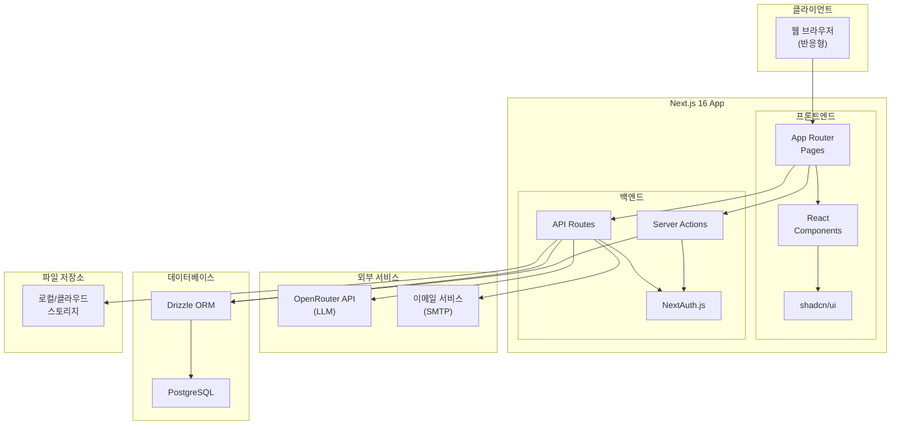
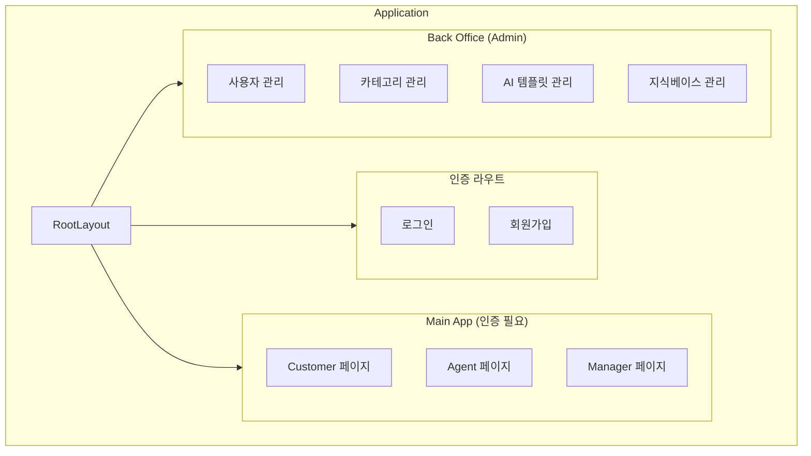
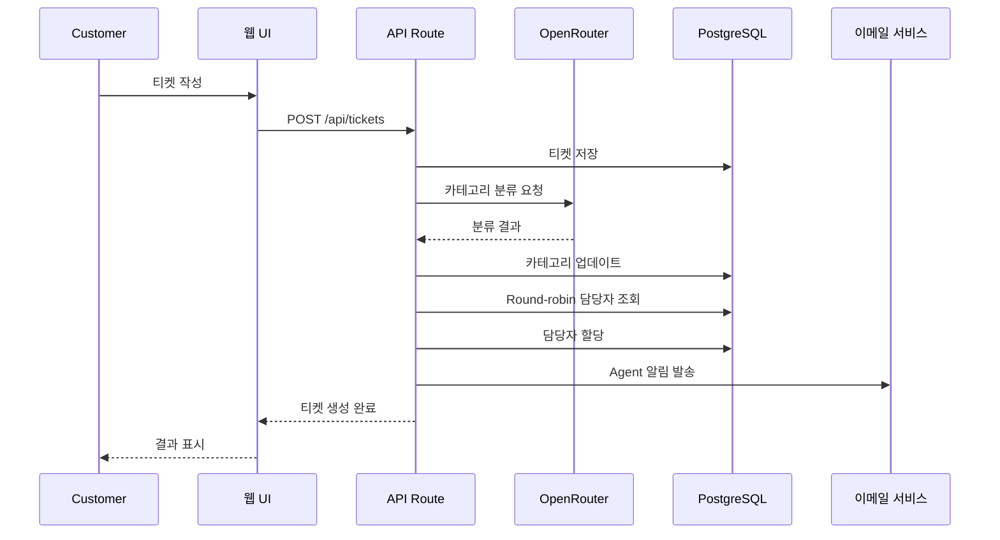
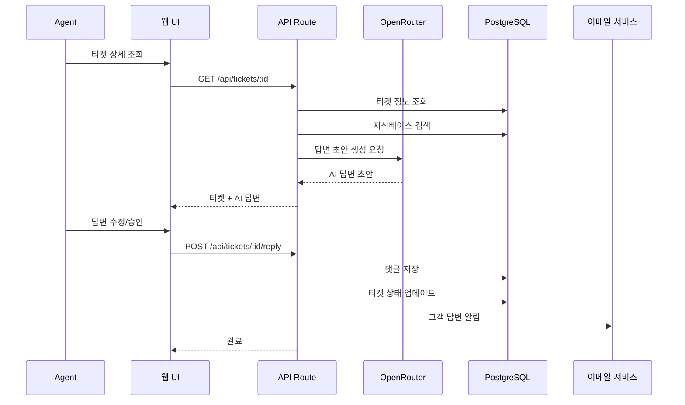
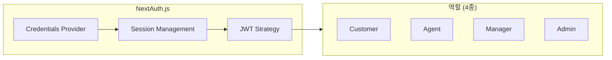
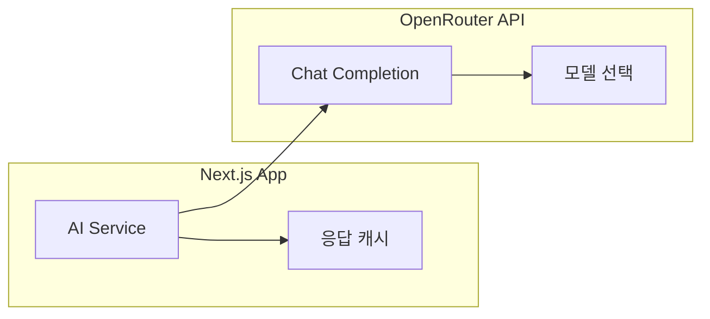
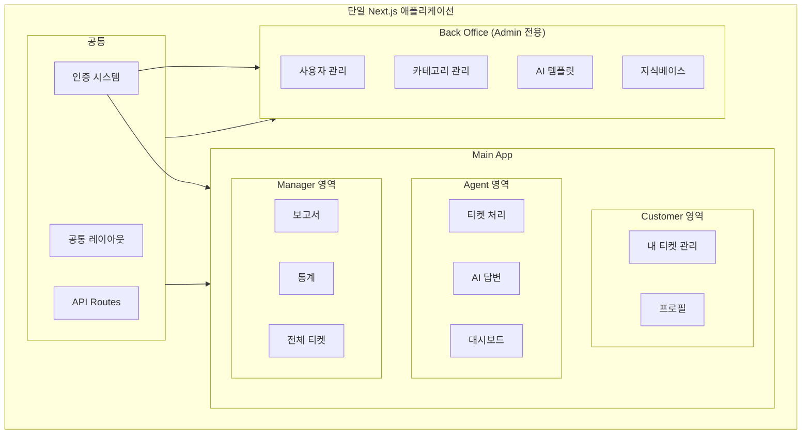
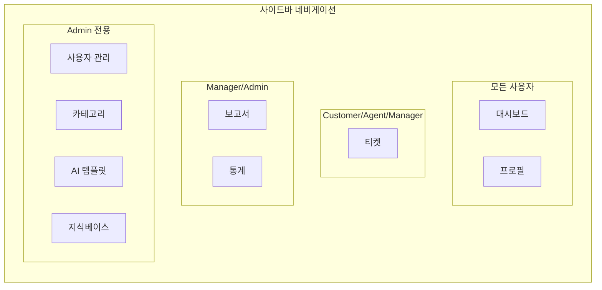
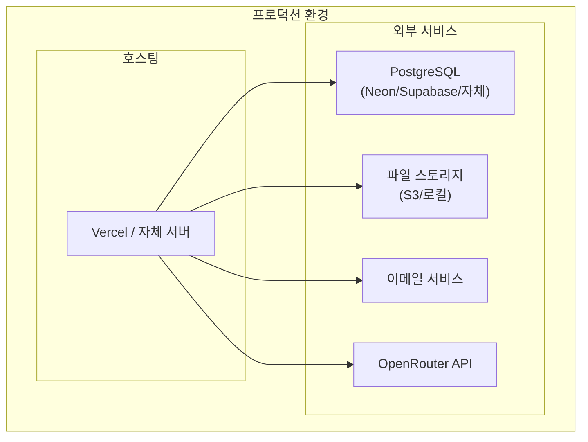

# AI Help Desk - 시스템 아키텍처

## 개요

AI Help Desk는 Next.js 기반의 풀스택 애플리케이션으로, 고객 문의 티켓 관리와 AI 기반 답변 제안 기능을 제공합니다.

---

## 시스템 아키텍처



---

## 컴포넌트 계층 구조



---

## 데이터 흐름

### 티켓 생성 흐름



### AI 답변 제안 흐름



---

## NextAuth.js 통합 (4 역할)

### 인증 설정



### 역할별 권한 매트릭스

| 기능 | Customer | Agent | Manager | Admin |
|------|:--------:|:-----:|:-------:|:-----:|
| 티켓 생성 | O | O | O | O |
| 내 티켓 조회 | O | - | - | - |
| 할당된 티켓 처리 | - | O | O | O |
| 모든 티켓 조회 | - | - | O | O |
| AI 답변 사용 | - | O | O | O |
| 내부 노트 작성 | - | O | O | O |
| 대시보드 (개인) | O | O | - | - |
| 대시보드 (전체) | - | - | O | O |
| 통계/보고서 | - | - | O | O |
| 사용자 관리 | - | - | - | O |
| 카테고리 관리 | - | - | - | O |
| AI 템플릿 관리 | - | - | - | O |
| 지식베이스 관리 | - | - | O | O |

### 미들웨어 보호

```typescript
// middleware.ts 구조
export const config = {
  matcher: [
    '/dashboard/:path*',
    '/tickets/:path*',
    '/admin/:path*',
    '/api/:path*'
  ]
}
```

### 역할 기반 라우트 보호

| 경로 패턴 | 허용 역할 |
|----------|----------|
| `/` | 모든 사용자 |
| `/auth/*` | 비로그인 사용자 |
| `/dashboard` | Customer, Agent |
| `/tickets` | Customer, Agent, Manager |
| `/tickets/:id` | 관련 사용자 (본인 티켓 또는 담당자) |
| `/reports` | Manager, Admin |
| `/admin/*` | Admin |

---

## OpenRouter API 통합 (LLM)

### API 연동 구조



### LLM 기능별 사용

| 기능 | 용도 | 프롬프트 소스 |
|------|------|-------------|
| 카테고리 분류 | 티켓 자동 분류 | 시스템 프롬프트 |
| 답변 초안 생성 | AI 답변 제안 | 카테고리별 템플릿 + 지식베이스 |
| 유사 티켓 검색 | 과거 티켓 참조 | 시스템 프롬프트 |
| 감정 분석 | 고객 감정 파악 | 시스템 프롬프트 |

### API 호출 구조

```typescript
// AI Service 구조
interface AIService {
  classifyTicket(content: string): Promise<Category>
  generateResponse(ticket: Ticket, kb: KnowledgeBase[]): Promise<string>
  findSimilarTickets(content: string): Promise<Ticket[]>
  analyzeSentiment(content: string): Promise<Sentiment>
}
```

---

## Main App vs Back Office 구조

### 통합 애플리케이션 구조



### 디렉토리 구조

```
app/
├── (auth)/                    # 인증 관련 (로그인/회원가입)
│   ├── login/
│   └── register/
├── (main)/                    # Main App (인증 필요)
│   ├── dashboard/             # 대시보드
│   ├── tickets/               # 티켓 관리
│   │   ├── [id]/
│   │   └── new/
│   ├── reports/               # 보고서 (Manager+)
│   └── profile/               # 프로필
├── (admin)/                   # Back Office (Admin 전용)
│   ├── users/                 # 사용자 관리
│   ├── categories/            # 카테고리 관리
│   ├── templates/             # AI 템플릿
│   └── knowledge-base/        # 지식베이스
├── api/                       # API Routes
│   ├── auth/
│   ├── tickets/
│   ├── users/
│   ├── categories/
│   ├── ai/
│   └── knowledge-base/
└── layout.tsx                 # 루트 레이아웃
```

### 네비게이션 구조



---

## 기술 스택 상세

| 레이어 | 기술 | 용도 |
|--------|------|------|
| Frontend | Next.js 16 App Router | 풀스택 프레임워크 |
| UI | shadcn/ui + Tailwind CSS | UI 컴포넌트 |
| Charts | Recharts | 대시보드 차트 |
| State | React Server Components | 서버 상태 관리 |
| Auth | NextAuth.js v5 | 인증/인가 |
| ORM | Drizzle ORM | 데이터베이스 접근 |
| Database | PostgreSQL | 데이터 저장 |
| LLM | OpenRouter API | AI 기능 |
| Email | Nodemailer / SendGrid | 이메일 발송 |
| Validation | Zod | 스키마 검증 |
| Forms | React Hook Form | 폼 관리 |

---

## 배포 아키텍처



---

*문서 버전: 1.0*
*작성일: 2026-01-29*
