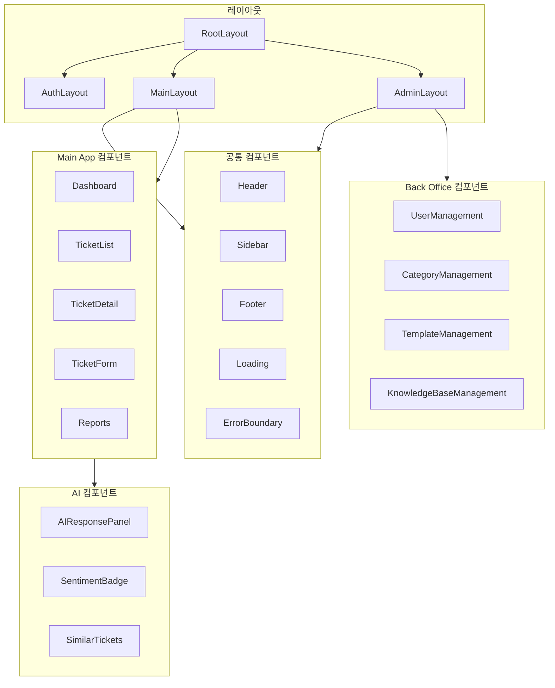

# AI Help Desk - 컴포넌트 구조

## 개요

React 컴포넌트 구조와 Props 정의입니다. shadcn/ui 기반으로 구성됩니다.

---

## 컴포넌트 계층 구조



---

## 디렉토리 구조

```
components/
├── ui/                          # shadcn/ui 기본 컴포넌트
│   ├── button.tsx
│   ├── input.tsx
│   ├── card.tsx
│   ├── dialog.tsx
│   ├── table.tsx
│   ├── badge.tsx
│   ├── select.tsx
│   ├── textarea.tsx
│   └── ...
├── layout/                      # 레이아웃 컴포넌트
│   ├── root-layout.tsx
│   ├── auth-layout.tsx
│   ├── main-layout.tsx
│   ├── admin-layout.tsx
│   ├── header.tsx
│   ├── sidebar.tsx
│   └── footer.tsx
├── common/                      # 공통 컴포넌트
│   ├── loading.tsx
│   ├── error-boundary.tsx
│   ├── pagination.tsx
│   ├── search-input.tsx
│   ├── file-upload.tsx
│   ├── confirm-dialog.tsx
│   └── empty-state.tsx
├── tickets/                     # 티켓 관련 컴포넌트
│   ├── ticket-list.tsx
│   ├── ticket-card.tsx
│   ├── ticket-detail.tsx
│   ├── ticket-form.tsx
│   ├── ticket-status-badge.tsx
│   ├── ticket-priority-badge.tsx
│   ├── ticket-comments.tsx
│   ├── ticket-history.tsx
│   ├── ticket-attachments.tsx
│   └── ticket-filters.tsx
├── dashboard/                   # 대시보드 컴포넌트
│   ├── dashboard-stats.tsx
│   ├── stat-card.tsx
│   ├── ticket-chart.tsx
│   └── recent-tickets.tsx
├── ai/                          # AI 관련 컴포넌트
│   ├── ai-response-panel.tsx
│   ├── sentiment-badge.tsx
│   ├── similar-tickets.tsx
│   └── category-suggestion.tsx
├── admin/                       # Back Office 컴포넌트
│   ├── user-management.tsx
│   ├── user-form.tsx
│   ├── user-table.tsx
│   ├── category-management.tsx
│   ├── category-form.tsx
│   ├── template-management.tsx
│   ├── template-form.tsx
│   ├── knowledge-base-management.tsx
│   └── knowledge-base-form.tsx
├── reports/                     # 보고서 컴포넌트
│   ├── reports-dashboard.tsx
│   ├── stats-overview.tsx
│   └── satisfaction-chart.tsx
└── auth/                        # 인증 컴포넌트
    ├── login-form.tsx
    ├── register-form.tsx
    └── user-menu.tsx
```

---

## 레이아웃 컴포넌트

### RootLayout

```typescript
// components/layout/root-layout.tsx

interface RootLayoutProps {
  children: React.ReactNode;
}

/**
 * 최상위 레이아웃
 * - 전역 스타일 적용
 * - 프로바이더 설정 (Session, Theme 등)
 */
export function RootLayout({ children }: RootLayoutProps): JSX.Element;
```

### MainLayout

```typescript
// components/layout/main-layout.tsx

interface MainLayoutProps {
  children: React.ReactNode;
}

/**
 * Main App 레이아웃 (인증된 사용자)
 * - Header (사용자 정보, 알림)
 * - Sidebar (역할별 네비게이션)
 * - Main Content
 */
export function MainLayout({ children }: MainLayoutProps): JSX.Element;
```

### AdminLayout

```typescript
// components/layout/admin-layout.tsx

interface AdminLayoutProps {
  children: React.ReactNode;
}

/**
 * Back Office 레이아웃 (Admin 전용)
 * - Header
 * - Admin Sidebar
 * - Main Content
 */
export function AdminLayout({ children }: AdminLayoutProps): JSX.Element;
```

### Header

```typescript
// components/layout/header.tsx

interface HeaderProps {
  user: {
    name: string;
    email: string;
    role: 'customer' | 'agent' | 'manager' | 'admin';
  };
}

/**
 * 상단 헤더
 * - 로고
 * - 검색 (옵션)
 * - 알림 아이콘
 * - 사용자 메뉴
 */
export function Header({ user }: HeaderProps): JSX.Element;
```

### Sidebar

```typescript
// components/layout/sidebar.tsx

interface SidebarProps {
  role: 'customer' | 'agent' | 'manager' | 'admin';
  currentPath: string;
}

interface NavItem {
  label: string;
  href: string;
  icon: React.ComponentType;
  roles: string[]; // 접근 가능한 역할
}

/**
 * 사이드바 네비게이션
 * - 역할별 메뉴 필터링
 * - 현재 경로 하이라이트
 */
export function Sidebar({ role, currentPath }: SidebarProps): JSX.Element;
```

---

## 티켓 컴포넌트

### TicketList

```typescript
// components/tickets/ticket-list.tsx

interface TicketListProps {
  tickets: Ticket[];
  totalCount: number;
  currentPage: number;
  pageSize: number;
  onPageChange: (page: number) => void;
  onTicketClick: (ticketId: string) => void;
  isLoading?: boolean;
}

interface Ticket {
  id: string;
  title: string;
  status: 'open' | 'in_progress' | 'resolved' | 'closed';
  priority: 'low' | 'medium' | 'high';
  category?: string;
  customerName: string;
  agentName?: string;
  createdAt: Date;
  updatedAt: Date;
}

/**
 * 티켓 목록
 * - 테이블 형태
 * - 페이지네이션
 * - 정렬/필터 적용
 */
export function TicketList(props: TicketListProps): JSX.Element;
```

### TicketFilters

```typescript
// components/tickets/ticket-filters.tsx

interface TicketFiltersProps {
  filters: TicketFilterValues;
  onFiltersChange: (filters: TicketFilterValues) => void;
  categories: Category[];
  agents?: Agent[]; // Manager/Admin만
}

interface TicketFilterValues {
  status?: string;
  priority?: string;
  categoryId?: string;
  agentId?: string;
  dateFrom?: Date;
  dateTo?: Date;
}

/**
 * 티켓 필터링
 * - 상태, 우선순위, 카테고리
 * - 담당자 (Manager/Admin)
 * - 날짜 범위
 */
export function TicketFilters(props: TicketFiltersProps): JSX.Element;
```

### TicketDetail

```typescript
// components/tickets/ticket-detail.tsx

interface TicketDetailProps {
  ticket: TicketWithRelations;
  currentUser: User;
  onStatusChange: (status: string) => void;
  onAssign: (agentId: string) => void;
  onAddComment: (content: string, isInternal: boolean) => void;
}

interface TicketWithRelations {
  id: string;
  title: string;
  content: string;
  status: string;
  priority: string;
  sentiment?: string;
  category?: Category;
  customer: User;
  agent?: User;
  comments: Comment[];
  attachments: Attachment[];
  history: HistoryItem[];
  slaResponseDeadline?: Date;
  slaResolveDeadline?: Date;
  createdAt: Date;
  resolvedAt?: Date;
}

/**
 * 티켓 상세
 * - 티켓 정보
 * - 댓글/대화
 * - 첨부파일
 * - 이력
 * - AI 답변 패널 (Agent)
 * - 상태/담당자 변경 (권한에 따라)
 */
export function TicketDetail(props: TicketDetailProps): JSX.Element;
```

### TicketForm

```typescript
// components/tickets/ticket-form.tsx

interface TicketFormProps {
  categories: Category[];
  onSubmit: (data: TicketFormData) => void;
  isLoading?: boolean;
}

interface TicketFormData {
  title: string;
  content: string;
  categoryId?: string;
  priority: 'low' | 'medium' | 'high';
  attachments?: File[];
}

/**
 * 티켓 생성 폼
 * - 제목, 내용 (필수)
 * - 카테고리, 우선순위 (선택)
 * - 파일 첨부
 */
export function TicketForm(props: TicketFormProps): JSX.Element;
```

### TicketComments

```typescript
// components/tickets/ticket-comments.tsx

interface TicketCommentsProps {
  comments: Comment[];
  currentUser: User;
  canAddInternal: boolean; // Agent/Manager/Admin만
  onAddComment: (content: string, isInternal: boolean) => void;
  isSubmitting?: boolean;
}

interface Comment {
  id: string;
  content: string;
  isInternal: boolean;
  user: {
    name: string;
    role: string;
  };
  createdAt: Date;
}

/**
 * 티켓 댓글/대화
 * - 댓글 목록
 * - 내부 노트 구분 (배경색 다름)
 * - 댓글 입력
 * - 내부 노트 토글 (권한 있을 때)
 */
export function TicketComments(props: TicketCommentsProps): JSX.Element;
```

### TicketStatusBadge

```typescript
// components/tickets/ticket-status-badge.tsx

interface TicketStatusBadgeProps {
  status: 'open' | 'in_progress' | 'resolved' | 'closed';
}

/**
 * 티켓 상태 뱃지
 * - open: 파랑
 * - in_progress: 노랑
 * - resolved: 초록
 * - closed: 회색
 */
export function TicketStatusBadge({ status }: TicketStatusBadgeProps): JSX.Element;
```

### TicketPriorityBadge

```typescript
// components/tickets/ticket-priority-badge.tsx

interface TicketPriorityBadgeProps {
  priority: 'low' | 'medium' | 'high';
}

/**
 * 티켓 우선순위 뱃지
 * - low: 회색
 * - medium: 파랑
 * - high: 빨강
 */
export function TicketPriorityBadge({ priority }: TicketPriorityBadgeProps): JSX.Element;
```

### TicketHistory

```typescript
// components/tickets/ticket-history.tsx

interface TicketHistoryProps {
  history: HistoryItem[];
}

interface HistoryItem {
  id: string;
  field: string;
  oldValue?: string;
  newValue?: string;
  user: {
    name: string;
  };
  createdAt: Date;
}

/**
 * 티켓 변경 이력
 * - 타임라인 형태
 * - 필드별 변경 내역
 */
export function TicketHistory({ history }: TicketHistoryProps): JSX.Element;
```

---

## 대시보드 컴포넌트

### DashboardStats

```typescript
// components/dashboard/dashboard-stats.tsx

interface DashboardStatsProps {
  stats: {
    totalOpen: number;
    totalInProgress: number;
    totalResolved: number;
    totalClosed: number;
    todayCreated: number;
    todayResolved: number;
  };
  isLoading?: boolean;
}

/**
 * 대시보드 통계 카드 그리드
 */
export function DashboardStats({ stats, isLoading }: DashboardStatsProps): JSX.Element;
```

### StatCard

```typescript
// components/dashboard/stat-card.tsx

interface StatCardProps {
  title: string;
  value: number;
  icon: React.ComponentType;
  trend?: {
    value: number;
    isPositive: boolean;
  };
  color?: 'blue' | 'yellow' | 'green' | 'gray';
}

/**
 * 개별 통계 카드
 */
export function StatCard(props: StatCardProps): JSX.Element;
```

### RecentTickets

```typescript
// components/dashboard/recent-tickets.tsx

interface RecentTicketsProps {
  tickets: Ticket[];
  onTicketClick: (ticketId: string) => void;
}

/**
 * 최근 티켓 목록 (5개)
 * - 간략한 정보 표시
 * - 클릭 시 상세로 이동
 */
export function RecentTickets({ tickets, onTicketClick }: RecentTicketsProps): JSX.Element;
```

---

## AI 컴포넌트

### AIResponsePanel

```typescript
// components/ai/ai-response-panel.tsx

interface AIResponsePanelProps {
  ticketId: string;
  ticketContent: string;
  categoryId?: string;
  onApply: (response: string) => void;
  onRegenerate: () => void;
}

interface AIResponse {
  content: string;
  isLoading: boolean;
  error?: string;
}

/**
 * AI 답변 제안 패널
 * - AI 생성 답변 표시
 * - 재생성 버튼
 * - 답변 적용 버튼
 * - 수정 후 적용 가능
 */
export function AIResponsePanel(props: AIResponsePanelProps): JSX.Element;
```

### SentimentBadge

```typescript
// components/ai/sentiment-badge.tsx

interface SentimentBadgeProps {
  sentiment: 'positive' | 'neutral' | 'negative';
}

/**
 * 감정 분석 뱃지
 * - positive: 초록 (긍정)
 * - neutral: 회색 (중립)
 * - negative: 빨강 (부정)
 */
export function SentimentBadge({ sentiment }: SentimentBadgeProps): JSX.Element;
```

### SimilarTickets

```typescript
// components/ai/similar-tickets.tsx

interface SimilarTicketsProps {
  ticketId: string;
  similarTickets: SimilarTicket[];
  isLoading?: boolean;
}

interface SimilarTicket {
  id: string;
  title: string;
  status: string;
  resolvedAt?: Date;
  similarity: number; // 0-100
}

/**
 * 유사 티켓 목록
 * - 과거 유사 티켓 표시
 * - 유사도 표시
 * - 클릭 시 상세 조회
 */
export function SimilarTickets(props: SimilarTicketsProps): JSX.Element;
```

### CategorySuggestion

```typescript
// components/ai/category-suggestion.tsx

interface CategorySuggestionProps {
  suggestedCategory?: Category;
  confidence: number; // 0-100
  onAccept: () => void;
  onReject: () => void;
}

/**
 * AI 카테고리 추천
 * - 추천 카테고리 표시
 * - 신뢰도 표시
 * - 수락/거부 버튼
 */
export function CategorySuggestion(props: CategorySuggestionProps): JSX.Element;
```

---

## Back Office 컴포넌트

### UserManagement

```typescript
// components/admin/user-management.tsx

interface UserManagementProps {
  users: User[];
  totalCount: number;
  currentPage: number;
  onPageChange: (page: number) => void;
  onCreateUser: (data: UserFormData) => void;
  onUpdateUser: (id: string, data: UserFormData) => void;
  onDeleteUser: (id: string) => void;
  onToggleOnline: (id: string, isOnline: boolean) => void;
  onToggleAway: (id: string, isAway: boolean) => void;
}

/**
 * 사용자 관리 페이지
 * - 사용자 목록 테이블
 * - 생성/수정/삭제
 * - Agent 상태 토글
 */
export function UserManagement(props: UserManagementProps): JSX.Element;
```

### UserForm

```typescript
// components/admin/user-form.tsx

interface UserFormProps {
  user?: User; // 수정 시
  onSubmit: (data: UserFormData) => void;
  onCancel: () => void;
  isLoading?: boolean;
}

interface UserFormData {
  email: string;
  name: string;
  password?: string; // 생성 시 필수, 수정 시 선택
  role: 'customer' | 'agent' | 'manager' | 'admin';
}

/**
 * 사용자 생성/수정 폼
 */
export function UserForm(props: UserFormProps): JSX.Element;
```

### CategoryManagement

```typescript
// components/admin/category-management.tsx

interface CategoryManagementProps {
  categories: CategoryWithTemplate[];
  onCreateCategory: (data: CategoryFormData) => void;
  onUpdateCategory: (id: string, data: CategoryFormData) => void;
  onDeleteCategory: (id: string) => void;
  onReorder: (categories: { id: string; sortOrder: number }[]) => void;
}

interface CategoryWithTemplate {
  id: string;
  name: string;
  sortOrder: number;
  isActive: boolean;
  template?: AIPromptTemplate;
}

/**
 * 카테고리 관리 페이지
 * - 카테고리 목록 (드래그 정렬)
 * - 생성/수정/삭제
 * - AI 템플릿 연결
 */
export function CategoryManagement(props: CategoryManagementProps): JSX.Element;
```

### TemplateManagement

```typescript
// components/admin/template-management.tsx

interface TemplateManagementProps {
  templates: AIPromptTemplate[];
  categories: Category[];
  onCreateTemplate: (data: TemplateFormData) => void;
  onUpdateTemplate: (id: string, data: TemplateFormData) => void;
  onDeleteTemplate: (id: string) => void;
}

interface TemplateFormData {
  categoryId: string;
  systemPrompt: string;
  userPromptTemplate: string;
}

/**
 * AI 프롬프트 템플릿 관리
 * - 템플릿 목록
 * - 카테고리별 템플릿 설정
 */
export function TemplateManagement(props: TemplateManagementProps): JSX.Element;
```

### KnowledgeBaseManagement

```typescript
// components/admin/knowledge-base-management.tsx

interface KnowledgeBaseManagementProps {
  articles: KnowledgeBaseArticle[];
  categories: Category[];
  totalCount: number;
  currentPage: number;
  onPageChange: (page: number) => void;
  onCreateArticle: (data: ArticleFormData) => void;
  onUpdateArticle: (id: string, data: ArticleFormData) => void;
  onDeleteArticle: (id: string) => void;
}

interface KnowledgeBaseArticle {
  id: string;
  title: string;
  content: string;
  category?: Category;
  isActive: boolean;
  createdAt: Date;
  updatedAt: Date;
}

interface ArticleFormData {
  title: string;
  content: string;
  categoryId?: string;
  isActive: boolean;
}

/**
 * 지식베이스 관리
 * - 문서 목록
 * - 생성/수정/삭제
 * - 카테고리 분류
 */
export function KnowledgeBaseManagement(props: KnowledgeBaseManagementProps): JSX.Element;
```

---

## 공통 컴포넌트

### FileUpload

```typescript
// components/common/file-upload.tsx

interface FileUploadProps {
  maxFiles?: number; // 기본 5
  maxSize?: number; // bytes, 기본 5MB
  acceptedTypes?: string[]; // MIME types
  onFilesChange: (files: File[]) => void;
  existingFiles?: Attachment[];
  onRemoveExisting?: (id: string) => void;
}

/**
 * 파일 업로드
 * - 드래그 앤 드롭
 * - 파일 선택
 * - 미리보기
 * - 크기/타입 검증
 */
export function FileUpload(props: FileUploadProps): JSX.Element;
```

### Pagination

```typescript
// components/common/pagination.tsx

interface PaginationProps {
  currentPage: number;
  totalPages: number;
  onPageChange: (page: number) => void;
  showFirstLast?: boolean;
}

/**
 * 페이지네이션
 */
export function Pagination(props: PaginationProps): JSX.Element;
```

### ConfirmDialog

```typescript
// components/common/confirm-dialog.tsx

interface ConfirmDialogProps {
  open: boolean;
  title: string;
  description: string;
  confirmText?: string;
  cancelText?: string;
  variant?: 'default' | 'destructive';
  onConfirm: () => void;
  onCancel: () => void;
}

/**
 * 확인 다이얼로그
 */
export function ConfirmDialog(props: ConfirmDialogProps): JSX.Element;
```

### EmptyState

```typescript
// components/common/empty-state.tsx

interface EmptyStateProps {
  icon?: React.ComponentType;
  title: string;
  description?: string;
  action?: {
    label: string;
    onClick: () => void;
  };
}

/**
 * 빈 상태 표시
 */
export function EmptyState(props: EmptyStateProps): JSX.Element;
```

### Loading

```typescript
// components/common/loading.tsx

interface LoadingProps {
  size?: 'sm' | 'md' | 'lg';
  text?: string;
  fullScreen?: boolean;
}

/**
 * 로딩 인디케이터
 */
export function Loading(props: LoadingProps): JSX.Element;
```

---

## 인증 컴포넌트

### LoginForm

```typescript
// components/auth/login-form.tsx

interface LoginFormProps {
  onSubmit: (data: LoginData) => void;
  isLoading?: boolean;
  error?: string;
}

interface LoginData {
  email: string;
  password: string;
}

/**
 * 로그인 폼
 */
export function LoginForm(props: LoginFormProps): JSX.Element;
```

### RegisterForm

```typescript
// components/auth/register-form.tsx

interface RegisterFormProps {
  onSubmit: (data: RegisterData) => void;
  isLoading?: boolean;
  error?: string;
}

interface RegisterData {
  email: string;
  name: string;
  password: string;
  confirmPassword: string;
}

/**
 * 회원가입 폼 (Customer용)
 */
export function RegisterForm(props: RegisterFormProps): JSX.Element;
```

### UserMenu

```typescript
// components/auth/user-menu.tsx

interface UserMenuProps {
  user: {
    name: string;
    email: string;
    role: string;
  };
  onLogout: () => void;
  onProfileClick: () => void;
}

/**
 * 사용자 메뉴 드롭다운
 */
export function UserMenu(props: UserMenuProps): JSX.Element;
```

---

## 보고서 컴포넌트

### ReportsDashboard

```typescript
// components/reports/reports-dashboard.tsx

interface ReportsDashboardProps {
  dateRange: {
    from: Date;
    to: Date;
  };
  onDateRangeChange: (range: { from: Date; to: Date }) => void;
}

/**
 * 보고서 대시보드
 * - 기간 선택
 * - 통계 개요
 * - 차트
 */
export function ReportsDashboard(props: ReportsDashboardProps): JSX.Element;
```

### SatisfactionChart

```typescript
// components/reports/satisfaction-chart.tsx

interface SatisfactionChartProps {
  data: {
    rating: number;
    count: number;
  }[];
  averageRating: number;
}

/**
 * 만족도 차트
 * - 평점 분포
 * - 평균 평점
 */
export function SatisfactionChart(props: SatisfactionChartProps): JSX.Element;
```

---

## 컴포넌트 의존성

```mermaid
graph TD
    subgraph UI["shadcn/ui"]
        Button
        Input
        Card
        Dialog
        Table
        Badge
        Select
        Textarea
        Tabs
        DropdownMenu
    end

    subgraph Layout["레이아웃"]
        Header --> DropdownMenu
        Header --> Button
        Sidebar --> Button
    end

    subgraph Tickets["티켓"]
        TicketList --> Table
        TicketList --> Badge
        TicketDetail --> Card
        TicketDetail --> Tabs
        TicketForm --> Input
        TicketForm --> Textarea
        TicketForm --> Select
        TicketComments --> Textarea
        TicketComments --> Button
    end

    subgraph AI["AI"]
        AIResponsePanel --> Card
        AIResponsePanel --> Button
        AIResponsePanel --> Textarea
        SentimentBadge --> Badge
    end

    subgraph Admin["관리"]
        UserManagement --> Table
        UserManagement --> Dialog
        CategoryManagement --> Table
        CategoryManagement --> Dialog
        TemplateManagement --> Textarea
        KnowledgeBaseManagement --> Table
    end
```



---

*문서 버전: 1.0*
*작성일: 2026-01-29*
