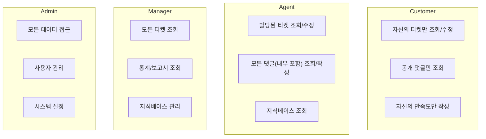

# AI Help Desk - 데이터베이스 설계

## 개요

PostgreSQL + Drizzle ORM을 사용한 데이터베이스 스키마 정의입니다.

---

## ERD (Entity Relationship Diagram)

```mermaid
erDiagram
    User ||--o{ Ticket : "creates (customer)"
    User ||--o{ Ticket : "handles (agent)"
    User ||--o{ TicketComment : writes
    User ||--o{ TicketHistory : causes

    Ticket ||--o{ TicketComment : has
    Ticket ||--o{ TicketAttachment : has
    Ticket ||--o{ TicketHistory : has
    Ticket ||--o| CustomerSatisfaction : has

    Category ||--o{ Ticket : categorizes
    Category ||--o| AIPromptTemplate : has
    Category ||--o{ KnowledgeBase : contains

    User {
        uuid id PK
        string email UK
        string passwordHash
        string name
        enum role
        boolean isOnline
        boolean isAway
        timestamp createdAt
        timestamp updatedAt
    }

    Ticket {
        uuid id PK
        string title
        text content
        enum status
        enum priority
        uuid categoryId FK
        uuid customerId FK
        uuid agentId FK
        timestamp slaResponseDeadline
        timestamp slaResolveDeadline
        boolean slaResponseMet
        boolean slaResolveMet
        timestamp createdAt
        timestamp updatedAt
        timestamp firstResponseAt
        timestamp resolvedAt
        timestamp closedAt
    }

    TicketComment {
        uuid id PK
        uuid ticketId FK
        uuid userId FK
        text content
        boolean isInternal
        timestamp createdAt
    }

    TicketAttachment {
        uuid id PK
        uuid ticketId FK
        string fileName
        string filePath
        integer fileSize
        string mimeType
        timestamp createdAt
    }

    TicketHistory {
        uuid id PK
        uuid ticketId FK
        uuid userId FK
        string field
        text oldValue
        text newValue
        timestamp createdAt
    }

    Category {
        uuid id PK
        string name UK
        integer sortOrder
        boolean isActive
        timestamp createdAt
        timestamp updatedAt
    }

    AIPromptTemplate {
        uuid id PK
        uuid categoryId FK UK
        text systemPrompt
        text userPromptTemplate
        timestamp createdAt
        timestamp updatedAt
    }

    KnowledgeBase {
        uuid id PK
        string title
        text content
        uuid categoryId FK
        boolean isActive
        timestamp createdAt
        timestamp updatedAt
    }

    CustomerSatisfaction {
        uuid id PK
        uuid ticketId FK UK
        integer rating
        text feedback
        timestamp createdAt
    }
```

---

## 테이블 정의 (Drizzle ORM)

### User (사용자)

```typescript
import { pgTable, uuid, varchar, text, boolean, timestamp, pgEnum } from 'drizzle-orm/pg-core';

export const userRoleEnum = pgEnum('user_role', ['customer', 'agent', 'manager', 'admin']);

export const users = pgTable('users', {
  id: uuid('id').defaultRandom().primaryKey(),
  email: varchar('email', { length: 255 }).notNull().unique(),
  passwordHash: text('password_hash').notNull(),
  name: varchar('name', { length: 100 }).notNull(),
  role: userRoleEnum('role').notNull().default('customer'),
  isOnline: boolean('is_online').notNull().default(false),
  isAway: boolean('is_away').notNull().default(false),
  createdAt: timestamp('created_at').notNull().defaultNow(),
  updatedAt: timestamp('updated_at').notNull().defaultNow(),
});
```

| 컬럼 | 타입 | 제약조건 | 설명 |
|------|------|---------|------|
| id | UUID | PK | 사용자 고유 ID |
| email | VARCHAR(255) | UNIQUE, NOT NULL | 이메일 (로그인 ID) |
| passwordHash | TEXT | NOT NULL | 암호화된 비밀번호 |
| name | VARCHAR(100) | NOT NULL | 사용자 이름 |
| role | ENUM | NOT NULL, DEFAULT 'customer' | 역할 (customer/agent/manager/admin) |
| isOnline | BOOLEAN | NOT NULL, DEFAULT false | Agent 온라인 상태 |
| isAway | BOOLEAN | NOT NULL, DEFAULT false | Agent 부재 상태 |
| createdAt | TIMESTAMP | NOT NULL, DEFAULT NOW | 생성일시 |
| updatedAt | TIMESTAMP | NOT NULL, DEFAULT NOW | 수정일시 |

---

### Ticket (티켓)

```typescript
export const ticketStatusEnum = pgEnum('ticket_status', ['open', 'in_progress', 'resolved', 'closed']);
export const ticketPriorityEnum = pgEnum('ticket_priority', ['low', 'medium', 'high']);

export const tickets = pgTable('tickets', {
  id: uuid('id').defaultRandom().primaryKey(),
  title: varchar('title', { length: 200 }).notNull(),
  content: text('content').notNull(),
  status: ticketStatusEnum('status').notNull().default('open'),
  priority: ticketPriorityEnum('priority').notNull().default('medium'),
  categoryId: uuid('category_id').references(() => categories.id),
  customerId: uuid('customer_id').notNull().references(() => users.id),
  agentId: uuid('agent_id').references(() => users.id),
  sentiment: varchar('sentiment', { length: 20 }), // positive, neutral, negative
  slaResponseDeadline: timestamp('sla_response_deadline'),
  slaResolveDeadline: timestamp('sla_resolve_deadline'),
  slaResponseMet: boolean('sla_response_met'),
  slaResolveMet: boolean('sla_resolve_met'),
  createdAt: timestamp('created_at').notNull().defaultNow(),
  updatedAt: timestamp('updated_at').notNull().defaultNow(),
  firstResponseAt: timestamp('first_response_at'),
  resolvedAt: timestamp('resolved_at'),
  closedAt: timestamp('closed_at'),
});
```

| 컬럼 | 타입 | 제약조건 | 설명 |
|------|------|---------|------|
| id | UUID | PK | 티켓 고유 ID |
| title | VARCHAR(200) | NOT NULL | 티켓 제목 |
| content | TEXT | NOT NULL | 문의 내용 |
| status | ENUM | NOT NULL, DEFAULT 'open' | 상태 (open/in_progress/resolved/closed) |
| priority | ENUM | NOT NULL, DEFAULT 'medium' | 우선순위 (low/medium/high) |
| categoryId | UUID | FK (categories) | 카테고리 ID |
| customerId | UUID | FK (users), NOT NULL | 고객 ID |
| agentId | UUID | FK (users) | 담당 Agent ID |
| sentiment | VARCHAR(20) | - | 감정 분석 결과 |
| slaResponseDeadline | TIMESTAMP | - | SLA 응답 마감 시간 |
| slaResolveDeadline | TIMESTAMP | - | SLA 해결 마감 시간 |
| slaResponseMet | BOOLEAN | - | SLA 응답 충족 여부 |
| slaResolveMet | BOOLEAN | - | SLA 해결 충족 여부 |
| createdAt | TIMESTAMP | NOT NULL | 생성일시 |
| updatedAt | TIMESTAMP | NOT NULL | 수정일시 |
| firstResponseAt | TIMESTAMP | - | 첫 응답 시간 |
| resolvedAt | TIMESTAMP | - | 해결 시간 |
| closedAt | TIMESTAMP | - | 종료 시간 |

---

### TicketComment (티켓 댓글)

```typescript
export const ticketComments = pgTable('ticket_comments', {
  id: uuid('id').defaultRandom().primaryKey(),
  ticketId: uuid('ticket_id').notNull().references(() => tickets.id, { onDelete: 'cascade' }),
  userId: uuid('user_id').notNull().references(() => users.id),
  content: text('content').notNull(),
  isInternal: boolean('is_internal').notNull().default(false),
  createdAt: timestamp('created_at').notNull().defaultNow(),
});
```

| 컬럼 | 타입 | 제약조건 | 설명 |
|------|------|---------|------|
| id | UUID | PK | 댓글 고유 ID |
| ticketId | UUID | FK (tickets), NOT NULL, CASCADE | 티켓 ID |
| userId | UUID | FK (users), NOT NULL | 작성자 ID |
| content | TEXT | NOT NULL | 댓글 내용 |
| isInternal | BOOLEAN | NOT NULL, DEFAULT false | 내부 노트 여부 |
| createdAt | TIMESTAMP | NOT NULL | 작성일시 |

---

### TicketAttachment (티켓 첨부파일)

```typescript
export const ticketAttachments = pgTable('ticket_attachments', {
  id: uuid('id').defaultRandom().primaryKey(),
  ticketId: uuid('ticket_id').notNull().references(() => tickets.id, { onDelete: 'cascade' }),
  fileName: varchar('file_name', { length: 255 }).notNull(),
  filePath: varchar('file_path', { length: 500 }).notNull(),
  fileSize: integer('file_size').notNull(), // bytes
  mimeType: varchar('mime_type', { length: 100 }).notNull(),
  createdAt: timestamp('created_at').notNull().defaultNow(),
});
```

| 컬럼 | 타입 | 제약조건 | 설명 |
|------|------|---------|------|
| id | UUID | PK | 첨부파일 고유 ID |
| ticketId | UUID | FK (tickets), NOT NULL, CASCADE | 티켓 ID |
| fileName | VARCHAR(255) | NOT NULL | 원본 파일명 |
| filePath | VARCHAR(500) | NOT NULL | 저장 경로 |
| fileSize | INTEGER | NOT NULL | 파일 크기 (bytes) |
| mimeType | VARCHAR(100) | NOT NULL | MIME 타입 |
| createdAt | TIMESTAMP | NOT NULL | 업로드일시 |

---

### TicketHistory (티켓 변경 이력)

```typescript
export const ticketHistories = pgTable('ticket_histories', {
  id: uuid('id').defaultRandom().primaryKey(),
  ticketId: uuid('ticket_id').notNull().references(() => tickets.id, { onDelete: 'cascade' }),
  userId: uuid('user_id').notNull().references(() => users.id),
  field: varchar('field', { length: 50 }).notNull(),
  oldValue: text('old_value'),
  newValue: text('new_value'),
  createdAt: timestamp('created_at').notNull().defaultNow(),
});
```

| 컬럼 | 타입 | 제약조건 | 설명 |
|------|------|---------|------|
| id | UUID | PK | 이력 고유 ID |
| ticketId | UUID | FK (tickets), NOT NULL, CASCADE | 티켓 ID |
| userId | UUID | FK (users), NOT NULL | 변경자 ID |
| field | VARCHAR(50) | NOT NULL | 변경 필드명 |
| oldValue | TEXT | - | 이전 값 |
| newValue | TEXT | - | 새 값 |
| createdAt | TIMESTAMP | NOT NULL | 변경일시 |

---

### Category (카테고리)

```typescript
export const categories = pgTable('categories', {
  id: uuid('id').defaultRandom().primaryKey(),
  name: varchar('name', { length: 100 }).notNull().unique(),
  sortOrder: integer('sort_order').notNull().default(0),
  isActive: boolean('is_active').notNull().default(true),
  createdAt: timestamp('created_at').notNull().defaultNow(),
  updatedAt: timestamp('updated_at').notNull().defaultNow(),
});
```

| 컬럼 | 타입 | 제약조건 | 설명 |
|------|------|---------|------|
| id | UUID | PK | 카테고리 고유 ID |
| name | VARCHAR(100) | UNIQUE, NOT NULL | 카테고리명 |
| sortOrder | INTEGER | NOT NULL, DEFAULT 0 | 정렬 순서 |
| isActive | BOOLEAN | NOT NULL, DEFAULT true | 활성화 여부 |
| createdAt | TIMESTAMP | NOT NULL | 생성일시 |
| updatedAt | TIMESTAMP | NOT NULL | 수정일시 |

---

### AIPromptTemplate (AI 프롬프트 템플릿)

```typescript
export const aiPromptTemplates = pgTable('ai_prompt_templates', {
  id: uuid('id').defaultRandom().primaryKey(),
  categoryId: uuid('category_id').references(() => categories.id, { onDelete: 'cascade' }).unique(),
  systemPrompt: text('system_prompt').notNull(),
  userPromptTemplate: text('user_prompt_template').notNull(),
  createdAt: timestamp('created_at').notNull().defaultNow(),
  updatedAt: timestamp('updated_at').notNull().defaultNow(),
});
```

| 컬럼 | 타입 | 제약조건 | 설명 |
|------|------|---------|------|
| id | UUID | PK | 템플릿 고유 ID |
| categoryId | UUID | FK (categories), UNIQUE, CASCADE | 카테고리 ID (1:1) |
| systemPrompt | TEXT | NOT NULL | 시스템 프롬프트 |
| userPromptTemplate | TEXT | NOT NULL | 사용자 프롬프트 템플릿 |
| createdAt | TIMESTAMP | NOT NULL | 생성일시 |
| updatedAt | TIMESTAMP | NOT NULL | 수정일시 |

---

### KnowledgeBase (지식베이스)

```typescript
export const knowledgeBases = pgTable('knowledge_bases', {
  id: uuid('id').defaultRandom().primaryKey(),
  title: varchar('title', { length: 200 }).notNull(),
  content: text('content').notNull(),
  categoryId: uuid('category_id').references(() => categories.id, { onDelete: 'set null' }),
  isActive: boolean('is_active').notNull().default(true),
  createdAt: timestamp('created_at').notNull().defaultNow(),
  updatedAt: timestamp('updated_at').notNull().defaultNow(),
});
```

| 컬럼 | 타입 | 제약조건 | 설명 |
|------|------|---------|------|
| id | UUID | PK | 문서 고유 ID |
| title | VARCHAR(200) | NOT NULL | 문서 제목 |
| content | TEXT | NOT NULL | 문서 내용 |
| categoryId | UUID | FK (categories), SET NULL | 카테고리 ID |
| isActive | BOOLEAN | NOT NULL, DEFAULT true | 활성화 여부 |
| createdAt | TIMESTAMP | NOT NULL | 생성일시 |
| updatedAt | TIMESTAMP | NOT NULL | 수정일시 |

---

### CustomerSatisfaction (고객 만족도)

```typescript
export const customerSatisfactions = pgTable('customer_satisfactions', {
  id: uuid('id').defaultRandom().primaryKey(),
  ticketId: uuid('ticket_id').notNull().references(() => tickets.id, { onDelete: 'cascade' }).unique(),
  rating: integer('rating').notNull(), // 1-5
  feedback: text('feedback'),
  createdAt: timestamp('created_at').notNull().defaultNow(),
});
```

| 컬럼 | 타입 | 제약조건 | 설명 |
|------|------|---------|------|
| id | UUID | PK | 만족도 고유 ID |
| ticketId | UUID | FK (tickets), UNIQUE, NOT NULL, CASCADE | 티켓 ID (1:1) |
| rating | INTEGER | NOT NULL | 평점 (1-5) |
| feedback | TEXT | - | 추가 피드백 |
| createdAt | TIMESTAMP | NOT NULL | 평가일시 |

---

## 인덱스

### User 인덱스

```typescript
// users 테이블 인덱스
export const usersEmailIdx = index('users_email_idx').on(users.email);
export const usersRoleIdx = index('users_role_idx').on(users.role);
export const usersOnlineIdx = index('users_online_idx').on(users.isOnline, users.isAway);
```

### Ticket 인덱스

```typescript
// tickets 테이블 인덱스
export const ticketsStatusIdx = index('tickets_status_idx').on(tickets.status);
export const ticketsPriorityIdx = index('tickets_priority_idx').on(tickets.priority);
export const ticketsCustomerIdx = index('tickets_customer_idx').on(tickets.customerId);
export const ticketsAgentIdx = index('tickets_agent_idx').on(tickets.agentId);
export const ticketsCategoryIdx = index('tickets_category_idx').on(tickets.categoryId);
export const ticketsCreatedAtIdx = index('tickets_created_at_idx').on(tickets.createdAt);
export const ticketsSlaResponseIdx = index('tickets_sla_response_idx').on(tickets.slaResponseDeadline);
export const ticketsSlaResolveIdx = index('tickets_sla_resolve_idx').on(tickets.slaResolveDeadline);

// 복합 인덱스: 대시보드 조회 최적화
export const ticketsStatusAgentIdx = index('tickets_status_agent_idx').on(tickets.status, tickets.agentId);
export const ticketsStatusCreatedIdx = index('tickets_status_created_idx').on(tickets.status, tickets.createdAt);
```

### TicketComment 인덱스

```typescript
// ticket_comments 테이블 인덱스
export const commentsTicketIdx = index('comments_ticket_idx').on(ticketComments.ticketId);
export const commentsCreatedAtIdx = index('comments_created_at_idx').on(ticketComments.createdAt);
```

### TicketHistory 인덱스

```typescript
// ticket_histories 테이블 인덱스
export const historiesTicketIdx = index('histories_ticket_idx').on(ticketHistories.ticketId);
export const historiesCreatedAtIdx = index('histories_created_at_idx').on(ticketHistories.createdAt);
```

### KnowledgeBase 인덱스

```typescript
// knowledge_bases 테이블 인덱스
export const kbCategoryIdx = index('kb_category_idx').on(knowledgeBases.categoryId);
export const kbActiveIdx = index('kb_active_idx').on(knowledgeBases.isActive);
```

---

## 인덱스 요약

| 테이블 | 인덱스명 | 컬럼 | 용도 |
|--------|---------|------|------|
| users | users_email_idx | email | 로그인 조회 |
| users | users_role_idx | role | 역할별 필터링 |
| users | users_online_idx | isOnline, isAway | Round-robin 할당 |
| tickets | tickets_status_idx | status | 상태별 필터링 |
| tickets | tickets_priority_idx | priority | 우선순위별 필터링 |
| tickets | tickets_customer_idx | customerId | 고객별 티켓 조회 |
| tickets | tickets_agent_idx | agentId | 담당자별 티켓 조회 |
| tickets | tickets_category_idx | categoryId | 카테고리별 필터링 |
| tickets | tickets_created_at_idx | createdAt | 최신순 정렬 |
| tickets | tickets_sla_response_idx | slaResponseDeadline | SLA 경고 조회 |
| tickets | tickets_sla_resolve_idx | slaResolveDeadline | SLA 경고 조회 |
| tickets | tickets_status_agent_idx | status, agentId | 대시보드 조회 |
| tickets | tickets_status_created_idx | status, createdAt | 대시보드 조회 |
| ticket_comments | comments_ticket_idx | ticketId | 티켓별 댓글 조회 |
| ticket_histories | histories_ticket_idx | ticketId | 티켓별 이력 조회 |
| knowledge_bases | kb_category_idx | categoryId | 카테고리별 KB 조회 |

---

## 권한 관리

### 역할 기반 데이터 접근



### Row-Level Security 정책 (참고)

```sql
-- Customer: 자신의 티켓만 조회
CREATE POLICY customer_tickets ON tickets
  FOR SELECT TO customer_role
  USING (customer_id = current_user_id());

-- Agent: 할당된 티켓 조회
CREATE POLICY agent_tickets ON tickets
  FOR SELECT TO agent_role
  USING (agent_id = current_user_id());

-- Manager/Admin: 모든 티켓 조회
CREATE POLICY manager_tickets ON tickets
  FOR SELECT TO manager_role, admin_role
  USING (true);
```

---

## 초기 데이터 (Seed)

### 기본 카테고리

```typescript
const defaultCategories = [
  { name: '결제', sortOrder: 1 },
  { name: '배송', sortOrder: 2 },
  { name: '반품/교환', sortOrder: 3 },
  { name: '계정', sortOrder: 4 },
  { name: '기타', sortOrder: 5 },
];
```

### 기본 Admin 계정

```typescript
const defaultAdmin = {
  email: 'admin@example.com',
  name: '관리자',
  role: 'admin',
  // password: 초기 설정 필요
};
```

---

*문서 버전: 1.0*
*작성일: 2026-01-29*
